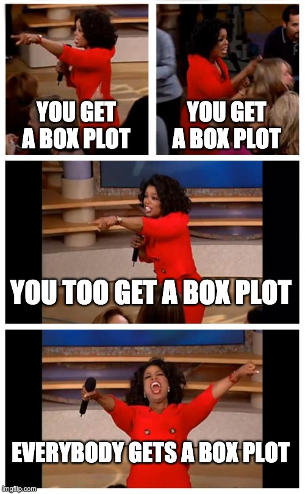

```{r setup, include=FALSE}
knitr::opts_chunk$set(echo = TRUE)
library(flair)
library(tidyverse)
#library(learnr)
```

## Introduction

The apply family of functions is one of the most commonly used classes and is used to manipulate data (in the form of matrices, arrays, dataframes, lists, etc.) repetitively. They are generally used to run a function on multiple chunks of data of an object.

If you have programmed before, the functionality of apply functions can be thought of as a 'for loop' but they are considered more efficient. \
In this lesson we will be covering apply, lapply and sapply. There is a huge variety of apply functions available, and while they work for different kinds of data, all of these have at least two common arguments- an object and a function (which can be either user-defined or built in) and we can "apply" the latter to the former. We will get into the details of the arguments and how to use them later. 


In this lesson, you will learn how to:

- Use apply, lapply and sapply (functions from the apply family)

- Use appropriate versions of the apply family of functions for the correct use cases


Prerequisites:

- Basic understanding of lists, vectors, arrays, matrices, and data frames
prerequisites


### Arguments

Let's first take a look at what the R documentation has as the arguments for these functions:

 - apply(X, MARGIN, FUN, ..., simplify = TRUE)

 - lapply(X, FUN, ...)
 
 - sapply(X, FUN, ..., simplify = TRUE, USE.NAMES = TRUE)

Where:


| Argument      | Details                                                                                         |
|---------------|-------------------------------------------------------------------------------------------------|
| X             | The object to which we want to apply the function (can be array/matrix/list/vector/data frame)  |
| MARGIN        | A vector to specify how the function is applied (1 for along row/2 for column)                   |
| FUN           | The function (in-built or user defined) to be applied repeatedly to the elements of X            |
| ...           | Optional arguments to FUN                                                                       |
| simplify      | Logical to pick simplified results (a matrix or vector when possible)                           |
| USE.NAMES     | Logical; set to TRUE X is character and want X as names for the result                          |


At first look these functions might all seem the same.


```{r image1, echo = FALSE, out.width="50%", fig.align="center"}
knitr::include_graphics("images/049-apply_sapply_lapply1.jpeg")
```


Now let's dive deeper into their differences to understand better.

## Apply
Let's start with apply which is the most basic from the apply family of functions. It operates primarily on arrays and matrices, and can occasionally work with data frames but with restrictions (the data frame object type must be compatible as function arguments).  

This is the only function (out of the ones covered in this lesson) that requires margins to be specified in the arguments. For example in the case of a matrix, 1 would mean the function would be applied along the rows, 2 would be columns, and c(1,2) would be both rows and columns. 

## Lapply
This is another member of the apply family of functions that operates on list, data frames, vectors. It has two main differences compared to apply-  

1) It always returns a list the same length as the input list

2) It does not require margin specification as it only applies the function to columns


## Sapply
The final apply function covered in this lesson is sapply. 

Just like lapply, sapply also operates on lists, data frames and vectors and does not need margin specification and just like in apply, we can use simplify = TRUE to simplify the results. 

Sapply is commonly known as "a user-friendly version of lapply". In layman's terms, sapply is a wrapper of lapply and the only difference is that it simplifies the output (when possible) and returns a vector instead of a list. 

**Note-** sapply(x, f, simplify = FALSE, USE.NAMES = FALSE) would be the same as lapply(x, f)

## Summary of differences table
To summarize the differences between these functions, we can use this table:
\


| Function | Operates on                 | Returns                             | Margins to specify(yes/no) |
|----------|-----------------------------|-------------------------------------|----------------------------|
| Apply    | arrays and matrices         | a vector or array or list of values | Yes                        |
| Lapply   | lists, data frames, vectors | a list                              | No                         |
| Sapply   | lists, data frames, vectors | a vector                            | No                         |


### Examples

#### Example 1
We will first work with the popular mtcars data set to understand how these functions work. Let's take a quick look at it 
```{r}
data <- mtcars
head(mtcars)
```
Let's subset this dataset to fit our needs better and call it cars. 
```{r, echo=FALSE}
cars <- data[c(4, 6 )]
```
We can now find the means of all columns:
```{r}
apply(cars, 2, mean)
```

We can also find the column quantiles using the quantile function

```{r}
apply(cars, 2, quantile, probs = c(0.10, 0.25, 0.50, 0.75, 0.90))
```

While it is not too relevant in this context, we can also compute the sum of rows like this:
```{r}
apply(cars, 1, sum)
```

#### Example 2

As mentioned before, we can also use a user-defined function with apply. Let's first generate a random matrix.
```{r}
mat <- matrix(rep(seq(5), 4), ncol = 5)
```

We can use either a user defined function inside the apply function. Here, we sum along the rows and add 5 to each element:
```{r}
apply(mat, 1, function(x) sum(x) + 5)
```
Or we can use the user-defined function as an argument:
```{r}
func <- function(x){
  return (sum(x)+5)
}
apply(mat, 1, func)
```


#### Example 3
We can create a random list to test out the lapply and sapply functions.
```{r}

list_i <- list(i1 = 1:10, 
             i2 = rnorm(20), 
             i3 = rnorm(20, 1), 
             i4 = rnorm(100, 5))
list_i

lapply(list_i, mean)
sapply(list_i, mean)

```
As you can see, lapply returns a more complicated vector output and sapply returns the same output in a list.


## Exercises 

### Question 1

<!-- ```{r letter-a, echo=FALSE}  -->
question("What is the output of the lapply function?",
  answer("a list", correct = TRUE),
  answer("an array"),
  answer("a vector")
)


### Question 2

**2a)** Use the numerical columns(columns 1-4) of the `iris` dataset to compute the minimum value of each column using apply, lapply and sapply and store the outputs.

```{r q2_a, exercise.eval = TRUE, exercise = TRUE}
head(iris)
```

```{r q2_a-solution}
ap <- apply(iris[,-5], MARGIN = 2,  FUN = min) 
l_ap <- lapply(iris[,-5], FUN = min) 
s_ap <- sapply(iris[,-5], FUN = min)
```

**2b)** Add the three outputs from above to a list called "list_output".
```{r q2_b, exercise.eval = TRUE, exercise = TRUE}

```

```{r q2_b-solution}
list_output <- list(ap, l_ap, s_ap )
```
 
**2c)** Use an appropriate apply function to find the type of each element of list_output (using the type of function) 
```{r q2_c, exercise.eval = TRUE, exercise = TRUE}

```

```{r q2_c-solution}
sapply(FUN = typeof, X = list_output) 
```


## Some extra notes

1) If you are deciding between using for loops or apply functions, always pick apply functions as they are slightly faster and require fewer lines of code. Using apply also makes the code easier to read and understand.


```{r image2, echo = FALSE, out.width="50%", fig.align="center"}

```

2) Apply functions are capable of a lot of cool things. We can also use the apply function to generate plots for the objects like this:
```{r, figures-side, fig.show="hold", out.width="50%", echo=FALSE,results='hide',fig.keep='all'}
head(iris)
apply(iris[,-5], 2, boxplot) #ignoring the Species column
```
Here, we are generating a box plot for all numerical columns of the iris data set.  
```{r image3, echo = FALSE, out.width="50%", fig.align="center"}

```

3) Using these functions can often be tricky. If you are ever struggling to decide between these functions and want the results simplified, the easiest option would be sapply. On the off-chance that you don't want simplified results, use lapply. Generally, either of these two would be ideal.
```{r image4, echo = FALSE, out.width="50%",fig.align="center"}

```

## Common mistakes and errors
- In the case of one dimensional data (like vectors), lapply or sapply should be used as the apply function will never work. It expects the data to have at least two dimensions and will give errors. 
- If your data happens to have NA values and you use apply function, the result would be NA regardless of the function choice. You can choose to ignore the NA values (if there are any) by using na.rm inside the apply function. 

## Next steps
- To know more about these functions, a useful resource is- https://www.analyticsvidhya.com/blog/2021/02/the-ultimate-swiss-army-knife-of-apply-family-in-r/
- You can explore other functions of the apply family like tapply, vapply, mapply
- You can also explore "apply-like" functions such as colSums, rowSums, colMeans, rowMeans, etc.

## References
- [r documentation] (https://www.rdocumentation.org/packages/base/versions/3.6.2/topics/apply).
