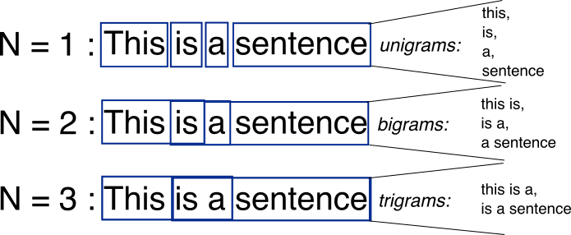

```{r setup, include=FALSE}
knitr::opts_chunk$set(echo = TRUE)
library(tidyverse)
library(tidytext)

```

# Tidytext and NLP


*Written by Haoluan Chen and last updated on 23 January 2022.*

## Introduction

In this lesson, you will learn:
- Understand basic terminologies in Natural language Processing 
- Apply text mining techniques to extract information from text
- Develop some understanding of Natural Language Processing 


Prerequisite skills include:

- install and load `tidytext` package
- familar with `tidyverse` and `ggplot` package

Highlights:

- Utilize tidy format and `tidytext` package to perform NLP techniques
- Learn how to tokenize, analyze word frequency, sentiment analysis, tokenizing by n-gram and more!


### Tokenization and Tidy Text 
In R, text is typically represented with the character data type such as `"Hello World".` In order to analyze text data, we need to take large sequences of characters and break them down into smaller text units. The process of splitting a text data into smaller meaningful units is called **tokenization**. Each of the meaningful units is called a token. Tokenization is an important step of Natural Language Processing because tokens are the building blocks of natural language. 

We use `unnest_tokens()` to do tokenization. 

```{r}
library(tidyverse)
library(tidytext)
my_string <- c("Hello World", "This is a tokenization example") # The strings that I want to tokenize 
data <- tibble(lines = 1:2, text = my_string)                   # Put it in a tibble 
data
unnest_tokens(data, word, text, token = "words")             # Using unnest_tokens() to tokenize the strings

unnest_tokens(my_string, word, text, token = "words") 
```
The `unnest_tokens()` takes Four parameters:

- The first parameter is a data frame
- The second parameter is the token column name in the output
- The third parameter is the input column that gets split into tokens.
- The fourth parameter is the unit for tokenizing. The default option is "words," which means splitting the text into words. we can also use "sentences", "paragraphs", "lines" as our tokenization unit.

In the example above, we tell R to take the "text" column in the data frame, split the text into words, and then output each individual word in the output table under the " word " column.

In the output table, we see that it split "Hello World" into "hello" and "world"(Note: in the output, all text is lower case). The lines column represents they came from the same string. This output table is in one-token-per-row format, which is also called the tidy text format. Using this tidy text format helps us analyze and utilize tools such as `tidyverse` and `ggplot`. 


### Word Frequency 
When we think about analyzing a text, one simple task is looking at the word frequency. Identifying the most frequent words in the text may give us important highlights about the text.   

```{r include=FALSE}
news <- c("TORONTO -- Ontario’s daily COVID-19 case count has surpassed 200 for the first time in almost two months." ,"On Friday, provincial health officials logged 213 new patients infected with the novel coronavirus." , "The other 26 local public health units in Ontario reported five or fewer COVID-19 cases on Friday, with 18 reporting none at all.", "The last time Ontario saw a daily case count climb above 200 was on July 21 and the last time the number of infections recorded in a single day was higher than 213 was on June 23 when 216 cases were confirmed.","The province’s daily count had hovered above the 100 mark for majority of the past three weeks.", "Most recently, Ontario saw 170 new cases of the disease confirmed on Thursday, 149 on Wednesday, 185 on Tuesday and 190 on Monday. The last time the province dipped into double digits was on Aug. 26 and before that it was on Aug. 20.", "The new patients logged on Friday bring Ontario’s total case count to 44,068, including deaths and recoveries.", "There were no new deaths linked to the novel coronavirus recorded by the province on Friday, but health officials did retract one deceased patient from Ontario’s death toll, which is now 2,813." , "Health officials deemed 124 more COVID-19 cases to be resolved in the province as of Friday. Ontario’s total number of recovered patients is now 39,598.", "There are now 1,657 active cases in the province.", "As of Friday, 49 COVID-19 patients are in Ontario hospitals. Eighteen of those patients are in the intensive care unit and nine of those patients are breathing with the assistance of a ventilator.", "Since the start of the pandemic, more than 3.2 million COVID-19 tests have been conducted in Ontario.", "In the last recorded 24-hour period, 32,501 tests were conducted.", "On July 21, nearly 23,000 COVID-19 tests were conducted and just more than 16,000 were conducted on June 23.", "There are currently 31,384 tests under investigation in the province.")
news_df <- tibble(line = 1:15, text = news)
news_df
news_token <- news_df %>% unnest_tokens(word, text) %>% 
  count(word, sort =TRUE)
news_token <- anti_join(news_token, stop_words, by = "word")


plot1 <- news_token %>% 
  filter(n > 3) %>% 
  mutate(word = reorder(word, n)) %>% 
  ggplot(aes(word,n)) + 
  geom_col(fill = "steelblue") +
  xlab("Word") +
  ylab("Frequency") +
  labs(title = "Word Frequency in a News") +
  coord_flip() + 
  theme_minimal()
```

Here is a bar plot showing word frequency in a news article. As we can see, the most frequently appeared word was "patients," "Friday," "covid," "19". With the most frequent words, we can get a big idea of what this news article is about.  

```{r echo=FALSE}
plot1
```

How do we do it? 

1. We load our text data and store it in a tibble. Each row in the news_df table is one sentence in the news. 

```{r}
news <- c("TORONTO -- Ontario’s daily COVID-19 case count has surpassed 200 for the first time in almost two months." ,"On Friday, provincial health officials logged 213 new patients infected with the novel coronavirus." , "The other 26 local public health units in Ontario reported five or fewer COVID-19 cases on Friday, with 18 reporting none at all.", "The last time Ontario saw a daily case count climb above 200 was on July 21 and the last time the number of infections recorded in a single day was higher than 213 was on June 23 when 216 cases were confirmed.","The province’s daily count had hovered above the 100 mark for majority of the past three weeks.", "Most recently, Ontario saw 170 new cases of the disease confirmed on Thursday, 149 on Wednesday, 185 on Tuesday and 190 on Monday. The last time the province dipped into double digits was on Aug. 26 and before that it was on Aug. 20.", "The new patients logged on Friday bring Ontario’s total case count to 44,068, including deaths and recoveries.", "There were no new deaths linked to the novel coronavirus recorded by the province on Friday, but health officials did retract one deceased patient from Ontario’s death toll, which is now 2,813." , "Health officials deemed 124 more COVID-19 cases to be resolved in the province as of Friday. Ontario’s total number of recovered patients is now 39,598.", "There are now 1,657 active cases in the province.", "As of Friday, 49 COVID-19 patients are in Ontario hospitals. Eighteen of those patients are in the intensive care unit and nine of those patients are breathing with the assistance of a ventilator.", "Since the start of the pandemic, more than 3.2 million COVID-19 tests have been conducted in Ontario.", "In the last recorded 24-hour period, 32,501 tests were conducted.", "On July 21, nearly 23,000 COVID-19 tests were conducted and just more than 16,000 were conducted on June 23.", "There are currently 31,384 tests under investigation in the province.")
news_df <- tibble(line = 1:15, text = news)
news_df
```

2. Use `unnest_tokens()` to tokenize our text.

```{r}
news_token <- news_df %>% unnest_tokens(word, text) %>% 
  count(word, sort =TRUE)
news_token
```

Note: ontario's and ontario were considered two different words, so the count for ontario was lower than its actual appearance in the text. So we can add the counts for ontario's and ontario together. 

However, this does not match what we saw before; words like "the" "on" were not in the word frequency plots. The reason is that these words are stop words, which are not so helpful for text analysis. Therefore, we want to remove them before further analysis. 


3. Remove stop words. 
The stop_words dataset in the tidytext package contains stop words from three lexicons. We can use them all together, or we can `filter()` to only use one set of stop words if it is more appropriate for your analysis. In this case, I used all three lexicons together. 

We can simply use `anti_join()` to remove stop words from our tokenization output to remove stop words. 

```{r}
news_token <- anti_join(news_token, stop_words, by = "word")
news_token
```

4. Visualization
Now, we can visualize the most frequent words in the news using `ggplot.` 

```{r}
plot1 <- news_token %>% 
  filter(n > 3) %>% 
  mutate(word = reorder(word, n)) %>% 
  ggplot(aes(word,n)) + 
  geom_col(fill = "steelblue") +
  xlab("Word") +
  ylab("Frequency") +
  labs(title = "Word Frequency in a News") +
  coord_flip() + 
  theme_minimal()
plot1
```

### Sentiment Analysis

With text data, we can also perform sentiment analysis. The main idea is to consider the text as a combination of individual words. Each of the words can be characterized as positive or negative in terms of its sentiment content. Then, the sentiment content of the whole text is the sum of the sentiment content of each individual word. 

The `Tidytext` package provides access to several sentiment lexicons: 

- `afinn` from Finn Årup Nielsen,
- `bing` from Bing Liu and collaborators, and
- `nrc` from Saif Mohammad and Peter Turney.

However, these lexicons have different categorizations for the words. 

- In `afinn,` words are assigned with scores between -5 to 5. Negative scores indicate negative sentiment, and positive scores indicate positive sentiment(Larger means more positive sentiment).  
- In `bing,` words are categorized into positive and negative categories. 
- In `nrc,` words are assigned with different sentiment content.

To see the sentiment lexicons, we can put in the name of the lexicon as input to the `get_sentiments().`

```{r}
get_sentiments("afinn")
get_sentiments("bing")
get_sentiments("nrc")
```

Note that you may have to install `textdata` package and agree to cite the lexicon when you use them in the R console. 

```{r eval=FALSE}
install.packages("textdata")
library(textdata)
```


There are different sentiment lexicons available. Some are domain-specific, which are constructed to be used with text from a specific content area. 


We can perform sentiment analysis using `inner_join()` with tidy text data format. 

Let's look at the sentiment content in the news example using `nrc` lexicon.

```{r}
news_df_sent <- news_df %>% unnest_tokens(word, text) %>%
  anti_join(stop_words, by = "word")

nrc_negative <- get_sentiments("nrc") %>% 
  filter(sentiment == "negative")
news_df_sent %>% 
  inner_join(nrc_negative) %>% 
  count(word, sort = TRUE)

nrc_positive <- get_sentiments("nrc") %>% 
  filter(sentiment == "positive")
news_df_sent %>% 
  inner_join(nrc_positive) %>% 
  count(word, sort = TRUE)
```

Since we have a small data set, there are only five negative words and seven positive words in the news article, which is all based on the `nrc` lexicon. Furthermore, we see that count was considered as a positive word, which may not be appropriate in this case. This shows that choosing an appropriate lexicon is important for your sentiment analysis. 


We can also find the sentiment score for each sentence in the article using `bing` lexicon and `inner_join().`

```{r}
news_sentiment <- news_df_sent %>% 
  inner_join(get_sentiments("bing")) 
news_sentiment <- news_df_sent %>% 
  inner_join(get_sentiments("bing")) %>% 
  count(sentence = line, sentiment)  %>% 
  spread(sentiment, n, fill = 0) %>%
  mutate(sentiment = positive - negative)
news_sentiment
```

Here, we see that the second sentence contains one negative word and no positive words, so the sentiment content for this sentence is -1. There are three negative words and one positive word for the eighth sentence. The sentiment score for the eighth sentence is -2.

Now, let's compare the three lexicons.

```{r}
afinn <- news_df_sent %>% 
  inner_join(get_sentiments("afinn")) %>% 
  group_by(sentence = line) %>% 
  summarise(sentiment = sum(value)) %>% 
  mutate(method = "AFINN")

bing <- news_df_sent %>% 
  inner_join(get_sentiments("bing")) %>%
  mutate(method = "bing")

nrc <- news_df_sent %>% 
  inner_join(get_sentiments("nrc")) %>% 
  filter(sentiment %in% c("positive", "negative")) %>%
  mutate(method = "NRC")


bing_and_nrc <- bind_rows(bing, nrc) %>% 
  count(method, sentence = line, sentiment) %>% 
  spread(sentiment, n, fill = 0) %>% 
  mutate(sentiment = positive - negative)

# plotting
bind_rows(afinn, bing_and_nrc) %>% 
  ggplot(aes(sentence, sentiment)) +
  geom_col() +
  facet_wrap(~method, ncol = 1, scales = "free_y") + 
  scale_x_discrete(limits = c(0, 2, 4, 6, 8, 10, 12))+
  xlab("Sentence")
  
```

The above plot shows the sentiment score for each sentence using three different lexicons. We see that different sentiment lexicons produced very different results for our dataset. This may be because we have a very small dataset. 

For most NLP tasks, we need a considerable large dataset to produce valid and useful results.


### Wordclouds 
Word clouds is another quick and easy way to see the most common words in your text data. 

In the `wordcloud` package, which uses base R graphics, we can look at the most common words in the news article again, but this time as a wordcloud.

```{r}
library(wordcloud)
news_token %>%
  count(word) %>% 
  with(wordcloud(word, n, max.words = 10))
```

There are other parameters for `wordcloud(),` such as min.freq to specify the words with a frequency below min.freq value will not be plotted. Type ?wordcloud in R console to learn more about it!


### Tokenizing by n-gram
So far, we have worked on words as individual units and considered their relationship to sentiments or documents. We can also analyze based on the relationships between words. We examine which words tend to follow others immediately or which ones co-occur within the same documents.

`unnest_tokens()` can also be used to split the text into consecutive sequences of words, called N-grams. N-grams can help us analyze relationships between words. 

The N in the name N-grams determines how many consecutive units to return.

When N = 1: it is called Uni-gram, which means tokenizing text into a single word.
When N = 2: it is called bi-grams, which means tokenizing text into two consecutive words.
When N = 3: it is called Tri-grams, which means tokenizing text into three consecutive words.




To tokenize text into N-gram, we simply specify `token = "ngrams"` and `n = how many consecutive unit` in `unnest_tokens()`:


```{r}
news_df %>% unnest_tokens(bigram, text, token = "ngrams", n = 2) %>% 
  count(bigram, sort = TRUE)
```

Again, many bi-grams consist of stop words that may not be so useful for our analysis. To remove them, we can use `separate()` to split up the bi-grams into two columns and remove the bi-gram if either word is a stop word. 

```{r}
bi_gram <- news_df %>% unnest_tokens(bigram, text, token = "ngrams", n = 2) %>% 
   separate(bigram, c("word1", "word2"), sep = " ")
bi_gram

bi_gram %>% filter(!word1 %in% stop_words$word) %>%
   filter(!word2 %in% stop_words$word)

```
Our 2-grams were reduced from 321 to only 79. Now we can count the 2-gram to check the most common 2-gram in the news. 

```{r}
bi_gram %>% filter(!word1 %in% stop_words$word) %>%
   filter(!word2 %in% stop_words$word) %>% 
  count(word1, word2, sort = TRUE)
```


The benefit of using N-grams:

1. N-gram captures the word order that is lost when we use word tokens.

2. Words “happy” and “like” will be counted as positive, even in a sentence like “I’m not happy, and I don’t like it!” 
Bi-grams help identify and fixes the problem of words that contributed sentiment score in the “wrong” direction.


## Exercises


### Question 1
<!-- ```{r exercise3, echo = FALSE} -->
<!-- question("What is a stop word?", -->
<!--           answer("Last word in a sentence"), -->
<!--           answer("words like "the", "on" that are very common in natural language and may not be useful for text analysis", correct = TRUE), -->
<!--           answer("Last word in a paragraph"), -->
<!--           answer("The word 'stop'"), -->
<!--           allow_retry = TRUE) -->

 
### Question 2
<!-- ```{r exercise3, echo = FALSE} -->
<!-- question("Which of the following are valid input for token parameter in unnest_tokens()?", -->
<!--           answer("words", correct = TRUE), -->
<!--           answer("characters", correct = TRUE), -->
<!--           answer("ngrams", correct = TRUE), -->
<!--           answer("regex", correct = TRUE), -->
<!--           answer("paragraphs", correct = TRUE), -->
<!--           allow_retry = TRUE) -->

### Question 3
<!-- ```{r exercise3, echo = FALSE} -->
<!-- question("Which sentiment lexicons is the best for any text data", -->
<!--           answer("bing"), -->
<!--           answer("nrc"), -->
<!--           answer("afinn"), -->
<!--           answer("There is no sentiment lexicon that is best for any text data", correct = TRUE), -->
<!--           allow_retry = TRUE) -->


### Question 4
```{r}
news <- c("TORONTO -- Ontario’s daily COVID-19 case count has surpassed 200 for the first time in almost two months." ,"On Friday, provincial health officials logged 213 new patients infected with the novel coronavirus." , "The other 26 local public health units in Ontario reported five or fewer COVID-19 cases on Friday, with 18 reporting none at all.", "The last time Ontario saw a daily case count climb above 200 was on July 21 and the last time the number of infections recorded in a single day was higher than 213 was on June 23 when 216 cases were confirmed.","The province’s daily count had hovered above the 100 mark for majority of the past three weeks.", "Most recently, Ontario saw 170 new cases of the disease confirmed on Thursday, 149 on Wednesday, 185 on Tuesday and 190 on Monday. The last time the province dipped into double digits was on Aug. 26 and before that it was on Aug. 20.", "The new patients logged on Friday bring Ontario’s total case count to 44,068, including deaths and recoveries.", "There were no new deaths linked to the novel coronavirus recorded by the province on Friday, but health officials did retract one deceased patient from Ontario’s death toll, which is now 2,813." , "Health officials deemed 124 more COVID-19 cases to be resolved in the province as of Friday. Ontario’s total number of recovered patients is now 39,598.", "There are now 1,657 active cases in the province.", "As of Friday, 49 COVID-19 patients are in Ontario hospitals. Eighteen of those patients are in the intensive care unit and nine of those patients are breathing with the assistance of a ventilator.", "Since the start of the pandemic, more than 3.2 million COVID-19 tests have been conducted in Ontario.", "In the last recorded 24-hour period, 32,501 tests were conducted.", "On July 21, nearly 23,000 COVID-19 tests were conducted and just more than 16,000 were conducted on June 23.", "There are currently 31,384 tests under investigation in the province.")
news_df <- tibble(line = 1:15, text = news)
news_df
```

<!-- tokenize the news text into tri-grams  -->
<!-- ```{r exercise5, exercise=TRUE, exercise.lines = 5} -->

<!-- ``` -->

## MCQ
1. What is a stop word?
  a. Last word in a sentence
  b.  Words like "the", "on" that are very common in natural language and may not be useful for text analysis
  c. Last word in a paragraph
  d. The word 'stop'
  
2. Which of the following are valid input for token parameter in unnest_tokens()?
  a. "words"
  b. "characters"
  c. "ngrams"
  d. "regex"
  d. "paragraphs"
  e.  All of the above

3. Which sentiment lexicons is the best for any text data?
  a. bing
  b. nrc
  c. afinn
  d.  There is no sentiment lexicon that is best for any text data

4. What is an uni-gram?
  a.  tokenizing text into a single word
  b. tokenizing text into a single sentence
  c. tokenizing text into two consecutive words
  d. None of the above

5. What can we do with uni-gram?
  a. Word Frequency 
  b. world cloud
  c. Sentiment Analysis
  d.  All of the above
  
6. One-token-per-row format is also called?
  a. One token format
  b.  Tidytext format
  c. text data format
  d. per token format
  
7. The process of splitting a text data into smaller meaningful units is called tokenization
  a.  True
  b. False
  
8. Assuming my_sting equal to a text string, will the following code run? `unnest_tokens(my_string, word, text, token = "words")` 
  a. Yes
  b.  No
  
9. inner_join() can be used to remove stop word.
  a.  True
  b. False
  
10. You should cite the sentiment lexicon when you used them for research and commercial
  a.  True
  b. False 

## Common Mistakes & Errors

- For `unnest_tokens()` make sure your input text data is in tibble (not in string). 

- If you see following error, that means you input text data is a string.
`Error in UseMethod("pull") : no applicable method for 'pull' applied to an object of class "character"`

- The `token` parameter for `unnest_tokens()` is a string. As shown here: 
`unnest_tokens(my_string, word, text, token = "words") `

- If you see this error, that means you have not install the `textdata` package. Using `install.package(textdata)` to install. 
`Error: The textdata package is required to download the AFINN lexicon. Install the textdata package to access this dataset.`


## Next Steps
The material in this tutorial is based on the book Text Mining with R by Julia Silge and David Robinson. You can check out here for more detail and larger examples. https://www.tidytextmining.com/index.html

Here is the source code for the tidytext package: https://github.com/juliasilge/tidytext

Here is the tidytext package page on cran: https://cran.r-project.org/web/packages/tidytext/index.html

If you are looking for more advanced NLP applications with machine learning, you can read Supervised Machine Learning for Text Analysis in R by EMIL HVITFELDT AND JULIA SILGE https://smltar.com/

If you are a University of Toronto student interested in taking an NLP course for credit, you can consider taking a reading course: ‘Natural Language Processing’ with Rohan Alexander. The outline is here: https://rohanalexander.com/reading_course-nlp.html

## References

Finn Årup Nielsen, "A new ANEW: evaluation of a word list for sentiment analysis in microblogs", Proceedings of the ESWC2011 Workshop on 'Making Sense of Microposts': Big things come in small packages. Volume 718 in CEUR Workshop Proceedings: 93-98. 2011 May. Matthew Rowe, Milan Stankovic, Aba-Sah Dadzie, Mariann Hardey (editors)

Minqing Hu and Bing Liu. "Mining and summarizing customer reviews." Proceedings of the ACM SIGKDD International Conference on Knowledge Discovery & Data Mining (KDD-2004, full paper), Seattle, Washington, USA, Aug 22-25, 2004.

Mohammad, S. & Turney, P. (2013). Crowdsourcing a Word-Emotion Association Lexicon. Computational Intelligence, 29(3), 436–465.


