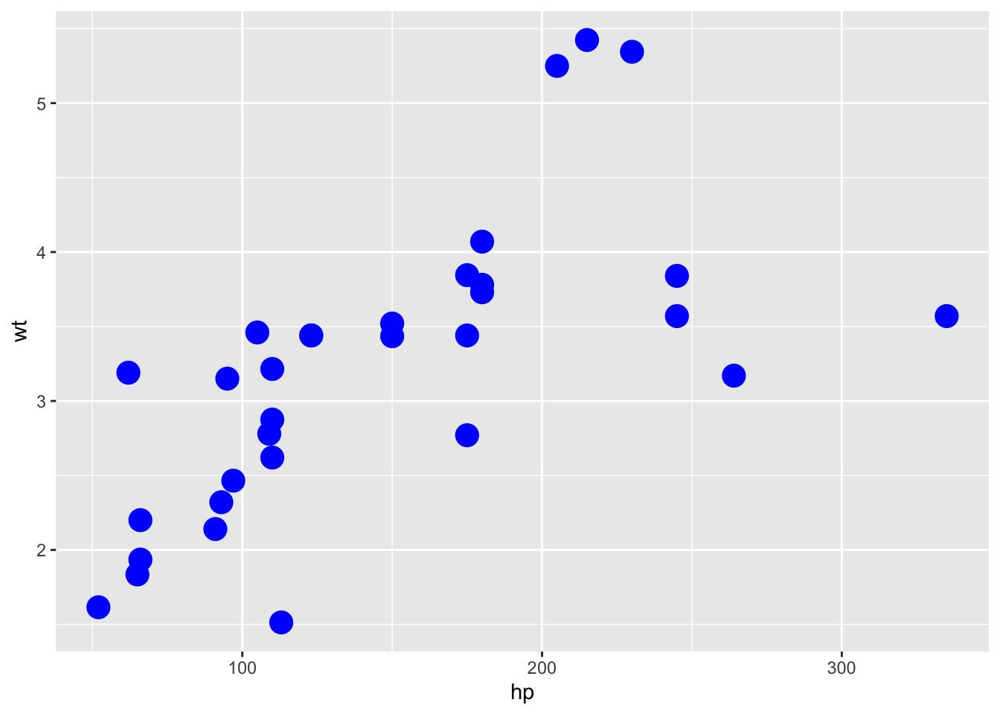

# Scatter plots

*Written by Haoluan Chen.*


## Introduction

In this lesson, you will learn how to:

- Create a scatter plot in R using ggplot2 package
- Customize your scatter plot

Prerequisite skills include:

- Install and load ggplot2 packages

- Basics of using ggplot2: e.g. `ggplot()`, `aes()`.

Highlights:

- Create and customize a scatter-plot


## The content

## What is a Scatter plot?

A scatter plot is a visual representation of two numerical variables. It allows you to see the correlation between the variables. 

Here, we have a dataset `mtcars` extracted from the 1974 Motor Trend US magazine.


```r
head(mtcars)
#>                    mpg cyl disp  hp drat    wt  qsec vs am
#> Mazda RX4         21.0   6  160 110 3.90 2.620 16.46  0  1
#> Mazda RX4 Wag     21.0   6  160 110 3.90 2.875 17.02  0  1
#> Datsun 710        22.8   4  108  93 3.85 2.320 18.61  1  1
#> Hornet 4 Drive    21.4   6  258 110 3.08 3.215 19.44  1  0
#> Hornet Sportabout 18.7   8  360 175 3.15 3.440 17.02  0  0
#> Valiant           18.1   6  225 105 2.76 3.460 20.22  1  0
#>                   gear carb
#> Mazda RX4            4    4
#> Mazda RX4 Wag        4    4
#> Datsun 710           4    1
#> Hornet 4 Drive       3    1
#> Hornet Sportabout    3    2
#> Valiant              3    1
```

`wt` is the weight (1000lbs), `mpg` is the miles per gallon for the car. Now we are interested in the relationship between these variables among 32 different cars.

Using the following code, we can create our basic scatter plot in R!


```r
# Basic scatter plot
ggplot(data = mtcars, mapping = aes(x=wt, y=mpg)) +
  geom_point()
```


In this plot, each dot shows one car's miles per gallon versus its weight. We can see a decreasing trend among the weight and the miles per gallon for the car.


## Arguments

### Basic scatter plot
- The size and the shape of points can be changed using the function geom_point() as follow :

geom_point(size, shape)


```r
# Change the point size
ggplot(mtcars, aes(x=wt, y=mpg)) +
  geom_point(size=2)
```


```r
# Change the point shape
ggplot(mtcars, aes(x=wt, y=mpg)) +
  geom_point(shape=23)
```


From the above figures, we know that we can change different sizes and shapes by changing parameters in `geom_point()`.

- The size of the points can be controlled by the values of a continuous variable as in the example below.


`cyl` is the number of cylinders of the car.


```r
# Change the point size by the values of cyl
ggplot(mtcars, aes(x=wt, y=mpg)) + 
  geom_point(aes(size=cyl))
```


## Change the appearance of the point
We can also change the color of the border of the point and filling of the point using the function geom_point() as follow :

geom_point(color, fill)


```r
# change shape, color, size
ggplot(mtcars, aes(x=wt, y=mpg)) +
  geom_point(shape=23, color="darkred",size=3)
```


```r

# change shape, color, fill, size
ggplot(mtcars, aes(x=wt, y=mpg)) +
  geom_point(shape=23, fill="blue", size=3)
```


## Scatter plots with multiple groups

We can also change the points, colors, and shapes based on a variable.
In the R code below, point shapes, colors, and sizes are controlled by the levels of the factor variable cyl :

**We are using as.factor here because cyl is a double data type in the dataset. Using as.factor() can transform cyl into factor data type**


```r
# Change point shapes by the levels of cyl
ggplot(mtcars, aes(x=wt, y=mpg)) +
  geom_point(aes(shape=as.factor(cyl)))
```


```r
# Change point shapes and colors
ggplot(mtcars, aes(x=wt, y=mpg)) +
  geom_point(aes(shape=as.factor(cyl), color=cyl))
```


```r
# change point shapes,  colors and sizes
ggplot(mtcars, aes(x=wt, y=mpg)) +
  geom_point(aes(shape=as.factor(cyl), color=cyl, size=cyl))
```


## Exercises

## Exercise 1 

Create a scatter plot to see the correlation between the hp and wt in mtcars


```r
mtcars
#>                      mpg cyl  disp  hp drat    wt  qsec vs
#> Mazda RX4           21.0   6 160.0 110 3.90 2.620 16.46  0
#> Mazda RX4 Wag       21.0   6 160.0 110 3.90 2.875 17.02  0
#> Datsun 710          22.8   4 108.0  93 3.85 2.320 18.61  1
#> Hornet 4 Drive      21.4   6 258.0 110 3.08 3.215 19.44  1
#> Hornet Sportabout   18.7   8 360.0 175 3.15 3.440 17.02  0
#> Valiant             18.1   6 225.0 105 2.76 3.460 20.22  1
#> Duster 360          14.3   8 360.0 245 3.21 3.570 15.84  0
#> Merc 240D           24.4   4 146.7  62 3.69 3.190 20.00  1
#> Merc 230            22.8   4 140.8  95 3.92 3.150 22.90  1
#> Merc 280            19.2   6 167.6 123 3.92 3.440 18.30  1
#> Merc 280C           17.8   6 167.6 123 3.92 3.440 18.90  1
#> Merc 450SE          16.4   8 275.8 180 3.07 4.070 17.40  0
#> Merc 450SL          17.3   8 275.8 180 3.07 3.730 17.60  0
#> Merc 450SLC         15.2   8 275.8 180 3.07 3.780 18.00  0
#> Cadillac Fleetwood  10.4   8 472.0 205 2.93 5.250 17.98  0
#> Lincoln Continental 10.4   8 460.0 215 3.00 5.424 17.82  0
#> Chrysler Imperial   14.7   8 440.0 230 3.23 5.345 17.42  0
#> Fiat 128            32.4   4  78.7  66 4.08 2.200 19.47  1
#> Honda Civic         30.4   4  75.7  52 4.93 1.615 18.52  1
#> Toyota Corolla      33.9   4  71.1  65 4.22 1.835 19.90  1
#> Toyota Corona       21.5   4 120.1  97 3.70 2.465 20.01  1
#> Dodge Challenger    15.5   8 318.0 150 2.76 3.520 16.87  0
#> AMC Javelin         15.2   8 304.0 150 3.15 3.435 17.30  0
#> Camaro Z28          13.3   8 350.0 245 3.73 3.840 15.41  0
#> Pontiac Firebird    19.2   8 400.0 175 3.08 3.845 17.05  0
#> Fiat X1-9           27.3   4  79.0  66 4.08 1.935 18.90  1
#> Porsche 914-2       26.0   4 120.3  91 4.43 2.140 16.70  0
#> Lotus Europa        30.4   4  95.1 113 3.77 1.513 16.90  1
#> Ford Pantera L      15.8   8 351.0 264 4.22 3.170 14.50  0
#> Ferrari Dino        19.7   6 145.0 175 3.62 2.770 15.50  0
#> Maserati Bora       15.0   8 301.0 335 3.54 3.570 14.60  0
#> Volvo 142E          21.4   4 121.0 109 4.11 2.780 18.60  1
#>                     am gear carb
#> Mazda RX4            1    4    4
#> Mazda RX4 Wag        1    4    4
#> Datsun 710           1    4    1
#> Hornet 4 Drive       0    3    1
#> Hornet Sportabout    0    3    2
#> Valiant              0    3    1
#> Duster 360           0    3    4
#> Merc 240D            0    4    2
#> Merc 230             0    4    2
#> Merc 280             0    4    4
#> Merc 280C            0    4    4
#> Merc 450SE           0    3    3
#> Merc 450SL           0    3    3
#> Merc 450SLC          0    3    3
#> Cadillac Fleetwood   0    3    4
#> Lincoln Continental  0    3    4
#> Chrysler Imperial    0    3    4
#> Fiat 128             1    4    1
#> Honda Civic          1    4    2
#> Toyota Corolla       1    4    1
#> Toyota Corona        0    3    1
#> Dodge Challenger     0    3    2
#> AMC Javelin          0    3    2
#> Camaro Z28           0    3    4
#> Pontiac Firebird     0    3    2
#> Fiat X1-9            1    4    1
#> Porsche 914-2        1    5    2
#> Lotus Europa         1    5    2
#> Ford Pantera L       1    5    4
#> Ferrari Dino         1    5    6
#> Maserati Bora        1    5    8
#> Volvo 142E           1    4    2
```


```r
mtcars %>% ggplot(aes(hp, wt)) + geom_point()
```


## Exercise 2
Set the size of the scatter plot in previous question to 5 


```r
mtcars %>% ggplot(aes(hp, wt)) + geom_point(size = 5)
```


## Exercise 3
Set the color of the scatter plot in previous question to blue


```r
mtcars %>% ggplot(aes(hp, wt)) + geom_point(size = 5, col = "blue")
```



## Common Mistakes & Errors

- If you want to change the colors and shapes based on a variable in your dataset, make sure it is a factor type dataset
- connect ggplot() and geom_point() by using `+` not `%>%`


## Next Steps

You may use geom_smooth() function to add a regression line on your scatter plot to get a clear pattern of your data. 


```r
ggplot(data = mtcars, mapping = aes(x=wt, y=mpg)) +
  geom_point() + 
  geom_smooth(method='lm') 
#> `geom_smooth()` using formula 'y ~ x'
```


Here is a guide for creating interesting scatter plots! http://www.sthda.com/english/wiki/ggplot2-scatter-plots-quick-start-guide-r-software-and-data-visualization


You may also change the title, axis, theme of your scatter plot! 

http://www.sthda.com/english/wiki/ggplot2-title-main-axis-and-legend-titles


