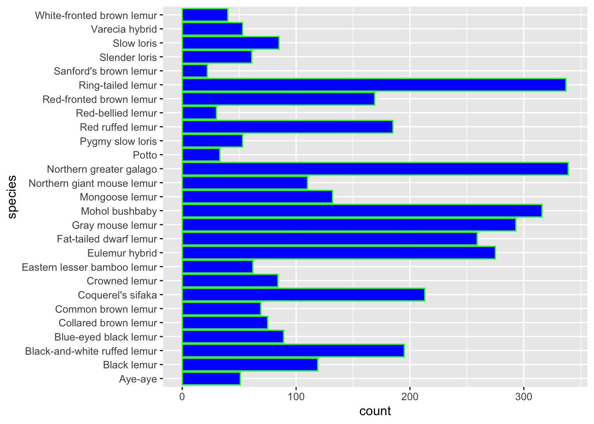

# Bar charts

*Written by Matthew Wankiewicz.*

## Introduction

In this lesson, you will learn how to:

- Plot bar charts using the `ggplot` package
- Customize bar charts with `ggplot`

Prerequisite skills include:

- Having `ggplot` installed and loaded
- Basic familiarity with `ggplot`

Highlights:

- Bar charts are the best way to display categorical data.
- The `ggplot` function allows you to customize your bar graphs.

## The content

When you encounter a dataset that does not include numerical data, the best way to visualize what you are working with is a bar chart. Generally, bar charts will have the categorical variable on the x-axis, and the count/percentage on the y-axis.

Bar charts are different from graphs like histograms because histograms display numerical variables while bar charts work best for categorical.

Bar charts are useful for getting a view of how your data looks and seeing which groups appear the most. 

## Arguments

The main arguments for making bar charts is part of the `ggplot` function:

- **data:** This represents the dataset you plan to use. You can either write `data = dataframe` or you can pipe the dataset into `ggplot`.
- **`aes():`** This is where you place the argument that decides which variable you are focusing on.
  - `x = variable:` This is the variable you want to display.
  - `fill = variable:` This can change the fill of your bar depending on the different options in your variable. 
- **`geom_bar():`** This is where you put any arguments to change the looks of your graph, whether it's colour or size of the bars.
  - **`fill:`** This argument decides the colour of the inside of the bars.
  - **`colour:`** This argument decides the colour of the outline of the bars.
- The `labs` function is useful for adding titles and subtitles to your graph.
  

## Other Optional Arguments

Some optional arguments for the `geom_bar()` function include:

  - **`width:`** This argument changes the width of the bars, it defaults at 0.9.
  - **`alpha:`** Changes the transparency of the bars.


## Questions

For this module, we will be using lemur data from Alex Cookson, https://github.com/tacookson/data/tree/master/duke-lemur-center.


```r
animals <- read_tsv("https://raw.githubusercontent.com/tacookson/data/master/duke-lemur-center/animals.txt")
```

Let's start with plotting a simple bar chart of the sex of the animals in the dataset. We will see that R names the x and y axis but does not add a title.

```r
animals %>% ggplot(aes(x = sex)) + 
  geom_bar()
```


We can also change the colours of the inside of the bars, using the fill argument. If we set it equal to green, we will get green bars.

```r
animals %>% ggplot(aes(x = sex)) +
  geom_bar(fill = "green")
```


Similarly, we can also change the colour of the outline of the bars. If we set it to red, the outline of the bars will be red.

```r
animals %>% ggplot(aes(x = sex)) +
  geom_bar(colour = "red")
```


Both the fill and colour arguments can be combined in the same call of the `geom_bar()` function


```r
animals %>% ggplot(aes(x = sex)) +
  geom_bar(fill = "white", colour = "red")
```


You can also change the colour/fill by adding the argument to the `aes()` expression. Doing this will give a specific colour for each value in your fill variable.

```r
animals %>% ggplot(aes(x = sex, fill = birth_type)) +
  geom_bar(colour = "black")
```


### Optional Arguments

Using the same data, we can change the width of the bars. Using a width greater than 0.9 will make the bars wider, and using a width smaller than 0.9 will make them thinner.


```r
animals %>% ggplot(aes(x = sex)) +
  geom_bar(fill = "white", colour = "red", 
           width = 1) 
```


### Adding labels to your bar charts

The `labs` function helps add labels such as titles, subtitles, and labels for the x and y axis.

```r
animals %>% ggplot(aes(x = sex)) +
  geom_bar(fill = "white", colour = "red") +
  labs(title = "My bar chart's title",
       subtitle = "Using animal data",
       x = "Sex",
       y = "Count")
```


For the most part, you won't really need to change the y-axis as it just gives the count, but make sure to change the x-axis if it is a confusing variable name.

### Plotting numeric variables

You can still create bar charts using numeric variables, provided that there aren't too many different numbers present.


```r
animals %>% 
  ggplot(aes(x = litter_size)) +
  geom_bar() +
  labs(title = "Distribution of Litter Sizes",
       x = "Litter Size")
```


### Rotating your bar chart

The `coord_flip` function works to rotate the bar chart, giving a different view of the data. It also helps display the labels on the x-axis if they are overlapped. For this example, we can rotate the graph that was plotted above.


```r
animals %>% 
  ggplot(aes(x = litter_size)) +
  geom_bar() +
  labs(title = "Distribution of Litter Sizes",
       x = "Litter Size") +
  coord_flip()
```


## Exercises

### Plot a Simple Bar Chart

Create a bar chart of the type of birth for the lemurs in the `animals` dataset. (Hint: the variable for type of birth is `birth_type`)

```r
# Enter code below
animals
#> # A tibble: 3,749 × 20
#>    animal_id studbook_id name   taxonomic_code species sex  
#>    <chr>     <chr>       <chr>  <chr>          <chr>   <chr>
#>  1 0001      <NA>        White… OGG            Northe… F    
#>  2 0002      <NA>        Bruis… OGG            Northe… M    
#>  3 0003      <NA>        George OGG            Northe… M    
#>  4 0004      <NA>        Tigger OGG            Northe… M    
#>  5 0005      <NA>        Kanga  OGG            Northe… M    
#>  6 0006      <NA>        Roo    OGG            Northe… F    
#>  7 0007      <NA>        Hermit OGG            Northe… M    
#>  8 0008      <NA>        Pigle… OGG            Northe… F    
#>  9 0009      <NA>        Pooh … OGG            Northe… M    
#> 10 0010      <NA>        Eeyore OGG            Northe… M    
#> # … with 3,739 more rows, and 14 more variables:
#> #   birth_date <date>, birth_type <chr>, litter_size <dbl>,
#> #   death_date <date>, mother_id <chr>, mother_name <chr>,
#> #   mother_taxonomic_code <chr>, mother_species <chr>,
#> #   mother_birth_date <date>, father_id <chr>,
#> #   father_name <chr>, father_taxonomic_code <chr>,
#> #   father_species <chr>, father_birth_date <date>
```


```r

animals %>% 
  ggplot(aes(x = birth_type)) +
  geom_bar()
```


### Making your bar chart a little more interesting

For this exercise, pick any colour to fill the bars of the bar chart and another colour for the outline. This time, plot the different types of species present in the dataset (don't worry about the labels overlapping, we'll address that later.)

```r
# Enter code below, choose any colour you want

```


```r

animals %>% 
  ggplot(aes(x = species)) + 
  geom_bar(fill = "blue", colour = "green")
```


Since there were so many unique names in the species variable, it causes the x-axis labels to overlap. We can fix this using `coord_flip`, try it out for yourself! Plot the same graph as above, but use the `coord_flip` function


```r
# Enter solution below

```


```r

animals %>% 
  ggplot(aes(x = species)) + 
  geom_bar(fill = "blue", colour = "green") + 
  coord_flip()
```



### Using the `aes()` fill option

For this exercise, plot the distribution of species of Lemur present in the dataset. Then, fill each bar depending on the sex of the lemur.


```r
animals %>% 
  ggplot(aes(x = sex, fill = species)) + 
  geom_bar() + 
  coord_flip()
```


```r
animals %>% 
  ggplot(aes(x = species, fill = sex)) + 
  geom_bar() + 
  coord_flip()
```


### Check your understanding

The next questions will focus on the plot below


<!-- ```{r bar-chart-quiz-1, echo=FALSE} -->
<!-- question("Select the functions that it looks like were used to make this bar chart.", -->
<!--          answer("ggplot", correct = T), -->
<!--          answer("coord_flip", correct = T), -->
<!--          answer("geom_bar", correct = T), -->
<!--          answer("geom_point", correct = F), -->
<!--          allow_retry = T) -->
<!-- ``` -->

<!-- ```{r bar-chart-quiz-2, echo=FALSE} -->
<!-- question("If I wanted to change the colour of the **inside** of the bars, which argument would I need to use?", -->
<!--          answer("fill = colour", correct = T), -->
<!--          answer("colour = colour", correct = F), -->
<!--          answer("inside = colour", correct = F), -->
<!--          answer("bar_colour = colour", correct = F), -->
<!--          allow_retry = T) -->
<!-- ``` -->

<!-- ```{r bar-chart-quiz-3, echo=FALSE} -->
<!-- question("What code chunk would make a plot identical to the plot above. (Feel free to copy these into your own R file)", -->
<!--   answer("animals %>%  -->
<!--   ggplot(aes(taxonomic_code)) + -->
<!--   geom_bar() + -->
<!--   labs(title = 'Distribution of Taxonomic Codes', -->
<!--        x = 'Taxonomic Code')", correct = F), -->
<!--   answer("animals %>%  -->
<!--   ggplot(aes(taxonomic_code)) + -->
<!--   geom_bar()", correct = FALSE), -->
<!--   answer("animals %>%  -->
<!--   ggplot(aes(taxonomic_code)) + -->
<!--   geom_bar() +  -->
<!--   coord_flip() + -->
<!--   labs(title = 'Distribution of Taxonomic Codes', -->
<!--        x = 'Taxonomic Code')", correct = T), -->
<!--   answer("animals %>%  -->
<!--   ggplot(aes(taxonomic_code)) + -->
<!--   geom_bar() +  -->
<!--   coord_flip()", correct = FALSE), -->
<!--          allow_retry = T) -->
<!-- ``` -->


## Common Mistakes & Errors

- If the outline for graphs shows up but there are no bars present, it likely occurred because you didn't add `geom_bar` to your expression.
  
- If your labels appear to overlap, you can try using `coord_flip` to space them out a bit. If that doesn't work, you can add the `theme` function and change the size, and angle of the text. For example, `theme(axis.text.x = element_text(angle=90))` puts the text at a 90 degree angle.

- When connecting `ggplot` to `geom_bar` make sure you use a plus sign (+) instead of the pipe operator. 

- If you get an error saying "object not found", it means that you may have missed a quotation mark around a colour or made a typo when referencing a variable.

## Next Steps

For more information on bar charts in R you can look at http://www.sthda.com/english/wiki/ggplot2-barplots-quick-start-guide-r-software-and-data-visualization

Another great resource for the different type of bar charts you can make in R is https://www.learnbyexample.org/r-bar-plot-ggplot2/


