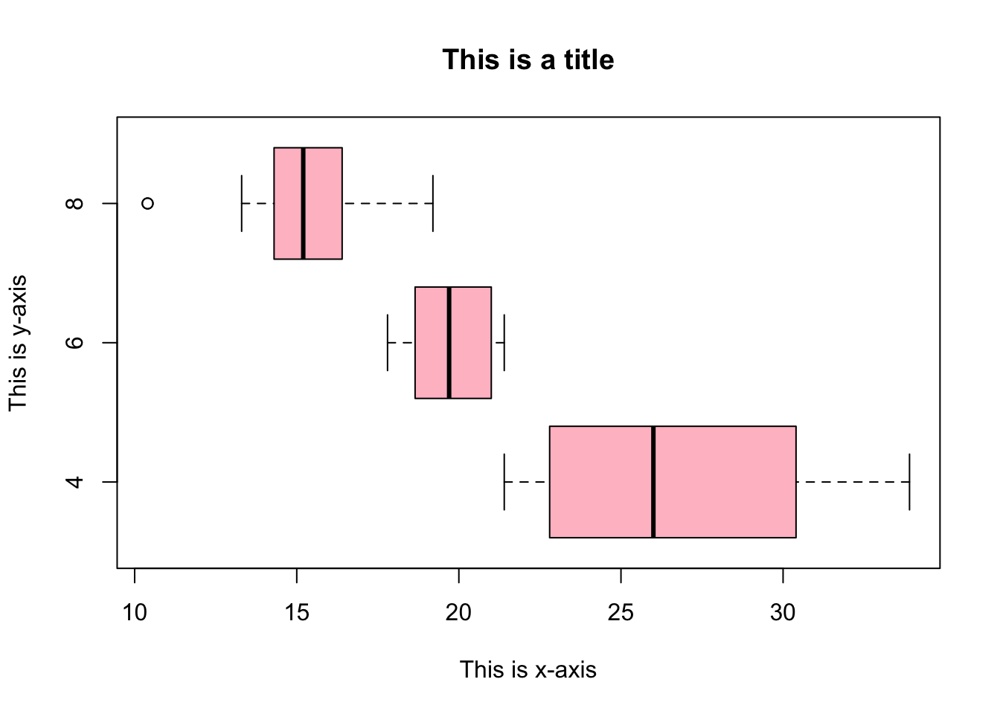

# hist, plot and boxplot

*Written by Yena Joo and last updated on 7 October 2021.*

## Introduction

R has various functions to produce a wide range of graphics to visualize data. Visualizing data is the first step of any analysis, since it provides you the broad idea and distribution of data that helps you build your hypothesis, so it is important to know how to plot base graphs using R. With the basic functions that R provides, we can easily and quickly make different types of graphs within seconds.  


In this lesson, you will learn how to: 

- create a histogram using `hist()` using various arguments.
- other base graphing options such as scatterplots and boxplots.
- export the created base graphs.

Prerequisite skills include:

- Import dataset
- materials from the previous modules
- choosing the right variables to plot

Highlights:

- `hist()`
- `plot()`
- `boxplot()`
- `export_type(file = filename)`

## Histogram: `hist()`

A histogram is a graph using bars of different heights, which shows the number of elements in each bin/category. It can also be called a frequency graph, where the y-axis is the frequency of the variable, and x is the range of the variable.  

You can create a histogram using the `hist()` function. The function has many arguments to control things such as bin size, title, labels, colours, etc.  

The function is composed of: 
```
hist(x, breaks = "Sturges", freq = NULL, probability = !freq, include.lowest = TRUE, right = TRUE, density = NULL, angle = 45, col = NULL, border = NULL, main = paste("Histogram of" , xname), xlim = range(breaks), ylim = NULL, xlab = xname, ylab, axes = TRUE, plot = TRUE, labels = FALSE, nclass = NULL, warn.unused = TRUE, …)
```

- x: a vector of values (ig. a column in a dataset).  
- breaks: number, vector, function of breakpoints between histogram cells.  
- main, xlab, ylab: title and axis labels.  

Here is an [additional information about the arguments](https://www.rdocumentation.org/packages/graphics/versions/3.6.2/topics/hist) you may find helpful.   

Let's work with an example with the built-in dataset called `mtcars`. Here are the first 6 observations of the dataset. 

```r
head(mtcars)
#>                    mpg cyl disp  hp drat    wt  qsec vs am
#> Mazda RX4         21.0   6  160 110 3.90 2.620 16.46  0  1
#> Mazda RX4 Wag     21.0   6  160 110 3.90 2.875 17.02  0  1
#> Datsun 710        22.8   4  108  93 3.85 2.320 18.61  1  1
#> Hornet 4 Drive    21.4   6  258 110 3.08 3.215 19.44  1  0
#> Hornet Sportabout 18.7   8  360 175 3.15 3.440 17.02  0  0
#> Valiant           18.1   6  225 105 2.76 3.460 20.22  1  0
#>                   gear carb
#> Mazda RX4            4    4
#> Mazda RX4 Wag        4    4
#> Datsun 710           4    1
#> Hornet 4 Drive       3    1
#> Hornet Sportabout    3    2
#> Valiant              3    1
```
Now let's create the histogram using `hist()` function above. 

```r
hist(x = mtcars$mpg)
```


### Number of Bins

You can change the number of bins to create a more accurate histogram since a large number of bins could hide important details about distribution which could make an error in the interpretation of the graph. To make a smaller number of bins, change the value of the argument `breaks = ` into how many bins you want to set in the histogram.  


```r
hist(x = mtcars$mpg, 
     breaks = 20)
```


Another way is to put the exact break points in the argument.


```r
hist(x = mtcars$mpg, 
     breaks = c(10, 20, 30, 40))
```


### Colour of the histogram

To change the colour of the histogram, use `col = ` argument, such as `col = "pink"`. The colour of the border of the bars could also be changed with the argument `border =`. 

```r
hist(x = mtcars$mpg, 
     breaks = 20,
     col = "pink", 
     border = "blue")
```


### Title and Axis

Once you are done fine-tuning the histogram, you can add your own title and axis labels using `main`, `xlab`, and `ylab` arguments. 

```r
hist(x = mtcars$mpg, 
     breaks = 20,
     main = "This is a title", 
     xlab = "This is x-axis",
     ylab = "This is y-axis")
```


   
For more specific arguments, you can always run `help("hist")` in the console to find more about the function.  


## Other base graphing options

### Scatterplot


A Scatter plot is another good way to visualize the data. There are many ways to create a scatterplot in R, but this is the most basic and the easiest way to create a scatterplot, using the function `plot(x, y)`. `x` and `y` arguments should be numerical values denoting (x,y) points. Using the same dataset, we can plot the scatterplot of `mpg` and `disp` as follows:  


```r
plot(x = mtcars$mpg, y = mtcars$disp)
```


  
To define the colour of the plot, you can use the argument `col = `. 
The arguments are basically the same as when we create a histogram. 


```r
plot(x = mtcars$mpg, y = mtcars$disp,
     col = "pink", 
     main = "This is a title", 
     xlab = "This is x-axis",
     ylab = "This is y-axis")
```


Detailed descriptions of the arguments could be found [here](https://www.rdocumentation.org/packages/graphics/versions/3.6.2/topics/plot) or type `help("plot")` in your console. 


### Boxplot


Boxplot is good for depicting groups of numerical data through their quartiles. The boxplot presents information such as median, minimum and maximum score, lower and upper quartile, and IQR. Boxplots also allow you to visualize the outliers and compare multiple distributions.  

To create a boxplot, simply use the function `boxplot()`.  

```r
boxplot(formula = mpg~cyl, data = mtcars)
```


Changing the colour, or labeling a title and axes is easy, the same as how we did for histograms and scatter plots. Also, you can use `horizontal=TRUE` to reverse the axis orientation.  


```r
boxplot(formula = mpg~cyl, data = mtcars,
        col = "pink", 
        main = "This is a title", 
        xlab = "This is x-axis",
        ylab = "This is y-axis", 
        horizontal = TRUE)
```



Detailed descriptions of the arguments could be found [here](https://www.rdocumentation.org/packages/graphics/versions/3.6.2/topics/boxplot) or type `help("boxplot")` in your console.   

## exporting base graphs 


Once you created a nice graph, you might want to save or export the graph. Set the file name for the plot you are going to save using the function `jpeg(file = filename.jpeg)`, if you want to save it as a jpeg image.  
For pdf files, use `pdf(file = filename.pdf)`.  
For png files , use `png(file = filename.png)`.   
We need to call the function `dev.off()` after plotting, which will return control to the screen.  

We can set the resolution we want using the `width` and `height` arguments or set the full local path of the file we want to save if we don’t want to save it in the current directory. 


```r
png(file = "scatterplot.png", width = 500, height = 300)
plot(x = mtcars$mpg, y = mtcars$disp)
dev.off()
#> quartz_off_screen 
#>                 2
```

## Exercises


### Question 1

Using the given dataset `USArrests`, create a histogram that depicts the distribution of assaults, set the bar colour to "blue" and set it to 15 bins. The title of the plot should be "Histogram of Assaults", with the x-axis "Assaults".

```r
head(USArrests)
#>            Murder Assault UrbanPop Rape
#> Alabama      13.2     236       58 21.2
#> Alaska       10.0     263       48 44.5
#> Arizona       8.1     294       80 31.0
#> Arkansas      8.8     190       50 19.5
#> California    9.0     276       91 40.6
#> Colorado      7.9     204       78 38.7
```


```r
hist(x = USArrests$Assault, 
     col = "blue", 
     main = "Histogram of Assaults", 
     xlab = "Assaults", 
     breaks = 15)
```


### Question 2


Save the plot you created in Question 1 as png file. The file name should be `answer2`. 


```r
png(file = "answer2.png")
hist(x = USArrests$Assault, 
     col = "blue", 
     main = "Histogram of Assaults", 
     xlab = "Assaults", 
     breaks = 15)
dev.off()
#> quartz_off_screen 
#>                 2
```


### Question 3

Create a scatter plot that depicts how the number of murders affects the number of rapes. Set the colour to pink, and the title of the plot should be "Scatterplot". X and y axes should be labeled as the variable name. 


```r
plot(x = USArrests$Murder, y = USArrests$Rape,
     col = "pink", 
     main = "Scatterplot", 
     xlab = "Murder",
     ylab = "Rape")
```


## Common mistakes & errors


Here are some common mistakes and errors you may come across:  

- Do not confound histogram with a barplot. They are different plots, where histograms visualize the frequency of numerical data, and bar charts visualize categorical data.   
- Bin size is important. Make sure you are using the right bin size.   


### Overview and Next steps

This is the last lecture of the module "Totally addicted to base".
With the functions we have learned today as well as in the previous lectures, you can create well-made base graphs and export them to present in your projects or papers. 
 
## References  


- [hist() function](https://www.rdocumentation.org/packages/graphics/versions/3.6.2/topics/hist)
- [scatterplots](https://www.statmethods.net/graphs/scatterplot.html)
- [boxplot() function](https://www.statmethods.net/graphs/boxplot.html)


## Exercises

### Question 1

### Question 2

### Question 3

### Question 4

### Question 5

### Question 6

### Question 7

### Question 8

### Question 9

### Question 10
