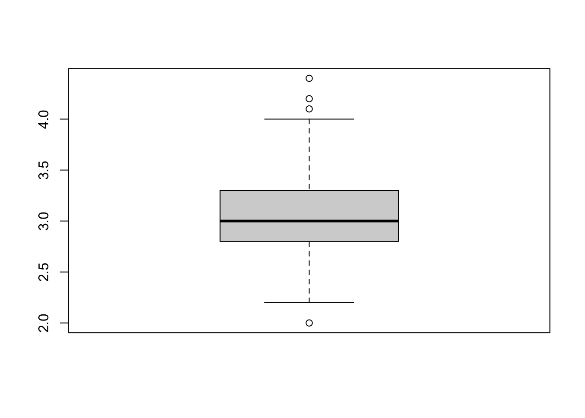
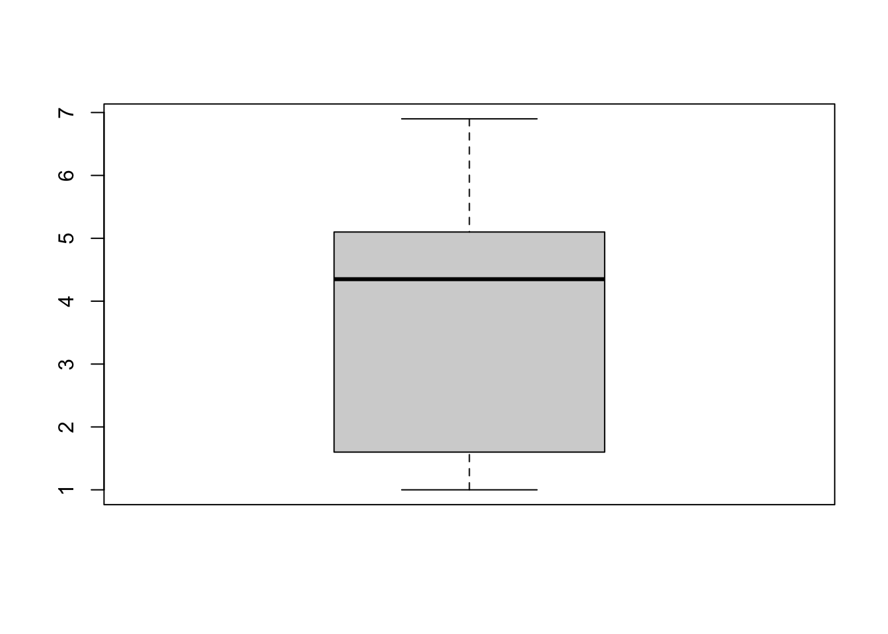
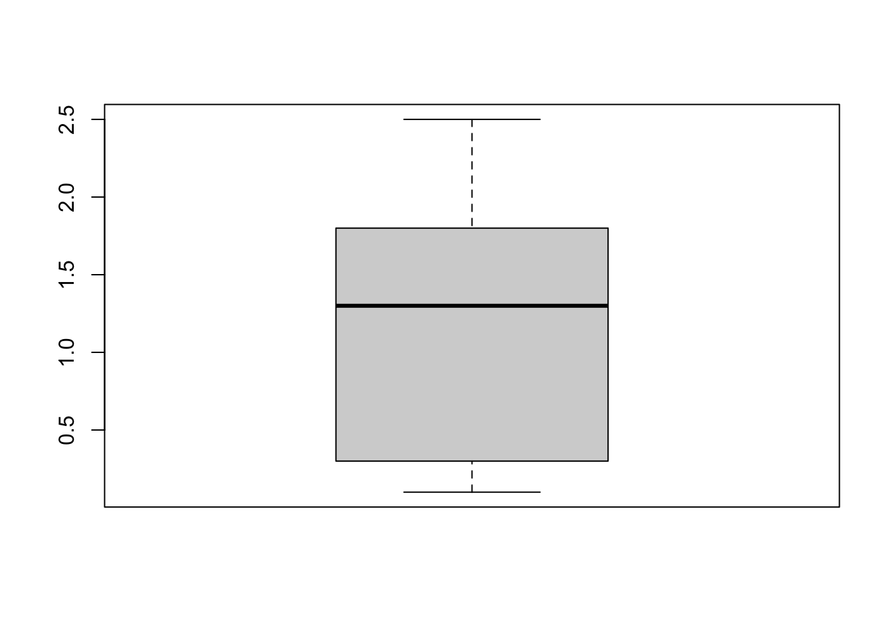

# apply, sapply, and lapply

*Written by Ananya Jha and last updated on 5 February 2022.*

## Introduction

The apply family of functions is one of the most commonly used classes and is used to manipulate data (in the form of matrices, arrays, dataframes, lists, etc.) repetitively. They are generally used to run a function on multiple chunks of data of an object.

If you have programmed before, the functionality of apply functions can be thought of as a 'for loop' but they are considered more efficient. \
In this lesson we will be covering `apply()`, `lapply()` and `sapply()`. There is a huge variety of apply functions available, and while they work for different kinds of data, all of these have at least two common arguments- an object and a function (which can be either user-defined or built in) and we can "apply" the latter to the former. We will get into the details of the arguments and how to use them later. 


In this lesson, you will learn how to:

- Use `apply()`, `lapply()` and `sapply()` (functions from the apply family)

- Use appropriate versions of the apply family of functions for the correct use cases


Prerequisites:

- Basic understanding of lists, vectors, arrays, matrices, and data frames
prerequisites


### Arguments

Let's first take a look at what the R documentation has as the arguments for these functions:

 - `apply(X, MARGIN, FUN, ..., simplify = TRUE)`

 - `lapply(X, FUN, ...)`
 
 - `sapply(X, FUN, ..., simplify = TRUE, USE.NAMES = TRUE)`

Where:


| Argument      | Details                                                                                         |
|---------------|-------------------------------------------------------------------------------------------------|
| X             | The object to which we want to apply the function (can be array/matrix/list/vector/data frame)  |
| MARGIN        | A vector to specify how the function is applied (1 for along row/2 for column)                   |
| FUN           | The function (in-built or user defined) to be applied repeatedly to the elements of X            |
| ...           | Optional arguments to FUN                                                                       |
| simplify      | Logical to pick simplified results (a matrix or vector when possible)                           |
| USE.NAMES     | Logical; set to TRUE X is character and want X as names for the result                          |


At first look these functions might all seem the same.


Now let's dive deeper into their differences to understand better.

## Apply

Let's start with `apply` which is the most basic from the apply family of functions. It operates primarily on arrays and matrices, and can occasionally work with data frames but with restrictions (the data frame object type must be compatible as function arguments).  

This is the only function (out of the ones covered in this lesson) that requires margins to be specified in the arguments. For example in the case of a matrix, 1 would mean the function would be applied along the rows, 2 would be columns, and c(1,2) would be both rows and columns. 

## Lapply

This is another member of the apply family of functions that operates on list, data frames, vectors. It has two main differences compared to `apply`-  

1) It always returns a list the same length as the input list

2) It does not require margin specification as it only applies the function to columns


## Sapply
The final apply function covered in this lesson is sapply. 

Just like `lapply`, `sapply` also operates on lists, data frames and vectors and does not need margin specification and just like in apply, we can use simplify = TRUE to simplify the results. 

`Sapply` is commonly known as "a user-friendly version of `lapply`". In layman's terms, sapply is a wrapper of lapply and the only difference is that it simplifies the output (when possible) and returns a vector instead of a list. 

**Note-** `sapply(x, f, simplify = FALSE, USE.NAMES = FALSE)` would be the same as `lapply(x, f)`

## Summary of differences table
To summarize the differences between these functions, we can use this table:
\


| Function | Operates on                 | Returns                             | Margins to specify(yes/no) |
|----------|-----------------------------|-------------------------------------|----------------------------|
| Apply    | arrays and matrices         | a vector or array or list of values | Yes                        |
| Lapply   | lists, data frames, vectors | a list                              | No                         |
| Sapply   | lists, data frames, vectors | a vector                            | No                         |


### Examples

#### Example 1
We will first work with the popular mtcars data set to understand how these functions work. Let's take a quick look at it 

```r
data <- mtcars
head(mtcars)
#>                    mpg cyl disp  hp drat    wt  qsec vs am
#> Mazda RX4         21.0   6  160 110 3.90 2.620 16.46  0  1
#> Mazda RX4 Wag     21.0   6  160 110 3.90 2.875 17.02  0  1
#> Datsun 710        22.8   4  108  93 3.85 2.320 18.61  1  1
#> Hornet 4 Drive    21.4   6  258 110 3.08 3.215 19.44  1  0
#> Hornet Sportabout 18.7   8  360 175 3.15 3.440 17.02  0  0
#> Valiant           18.1   6  225 105 2.76 3.460 20.22  1  0
#>                   gear carb
#> Mazda RX4            4    4
#> Mazda RX4 Wag        4    4
#> Datsun 710           4    1
#> Hornet 4 Drive       3    1
#> Hornet Sportabout    3    2
#> Valiant              3    1
```
Let's subset this dataset to fit our needs better and call it cars. 

We can now find the means of all columns:

```r
apply(cars, 2, mean)
#>        hp        wt 
#> 146.68750   3.21725
```

We can also find the column quantiles using the quantile function


```r
apply(cars, 2, quantile, probs = c(0.10, 0.25, 0.50, 0.75, 0.90))
#>        hp      wt
#> 10%  66.0 1.95550
#> 25%  96.5 2.58125
#> 50% 123.0 3.32500
#> 75% 180.0 3.61000
#> 90% 243.5 4.04750
```

While it is not too relevant in this context, we can also compute the sum of rows like this:

```r
apply(cars, 1, sum)
#>           Mazda RX4       Mazda RX4 Wag          Datsun 710 
#>             112.620             112.875              95.320 
#>      Hornet 4 Drive   Hornet Sportabout             Valiant 
#>             113.215             178.440             108.460 
#>          Duster 360           Merc 240D            Merc 230 
#>             248.570              65.190              98.150 
#>            Merc 280           Merc 280C          Merc 450SE 
#>             126.440             126.440             184.070 
#>          Merc 450SL         Merc 450SLC  Cadillac Fleetwood 
#>             183.730             183.780             210.250 
#> Lincoln Continental   Chrysler Imperial            Fiat 128 
#>             220.424             235.345              68.200 
#>         Honda Civic      Toyota Corolla       Toyota Corona 
#>              53.615              66.835              99.465 
#>    Dodge Challenger         AMC Javelin          Camaro Z28 
#>             153.520             153.435             248.840 
#>    Pontiac Firebird           Fiat X1-9       Porsche 914-2 
#>             178.845              67.935              93.140 
#>        Lotus Europa      Ford Pantera L        Ferrari Dino 
#>             114.513             267.170             177.770 
#>       Maserati Bora          Volvo 142E 
#>             338.570             111.780
```

#### Example 2

As mentioned before, we can also use a user-defined function with `apply`. Let's first generate a random matrix.

```r
mat <- matrix(rep(seq(5), 4), ncol = 5)
```

We can use either a user defined function inside the `apply` function. Here, we sum along the rows and add 5 to each element:

```r
apply(mat, 1, function(x) sum(x) + 5)
#> [1] 20 20 20 20
```
Or we can use the user-defined function as an argument:

```r
func <- function(x){
  return (sum(x)+5)
}
apply(mat, 1, func)
#> [1] 20 20 20 20
```


#### Example 3
We can create a random list to test out the `lapply` and `sapply` functions.

```r

list_i <- list(i1 = 1:10, 
             i2 = rnorm(20), 
             i3 = rnorm(20, 1), 
             i4 = rnorm(100, 5))
list_i
#> $i1
#>  [1]  1  2  3  4  5  6  7  8  9 10
#> 
#> $i2
#>  [1] -0.47617599  1.20575571 -1.80540580  0.07324597
#>  [5]  2.13916915 -0.63730209  0.19837271 -0.05810682
#>  [9] -1.04740088 -0.15709220 -0.34387825  0.46787565
#> [13]  0.64966345 -0.51747141  2.23800132 -0.61133575
#> [17]  0.48439766  1.75133041  0.05937313  1.53762279
#> 
#> $i3
#>  [1]  1.04391841  0.08172396  0.81966285  2.49785832
#>  [5]  2.06114920  1.64879252  1.41421716  0.03258409
#>  [9]  1.48312737  1.66806175  0.60632637 -0.02213511
#> [13]  2.41293998  1.93455858  1.84328760  1.28994039
#> [17]  0.40852044  1.18517122  1.47804048 -0.76204088
#> 
#> $i4
#>   [1] 4.319441 5.204050 5.802728 6.357109 6.422810 2.320485
#>   [7] 3.760352 4.740715 4.618245 4.988496 4.070717 4.020831
#>  [13] 6.331650 5.924110 5.619002 4.649274 6.524090 5.179226
#>  [19] 4.020148 4.508682 5.248510 5.319899 5.589665 5.698381
#>  [25] 6.564328 7.600409 5.040747 5.435394 3.386636 6.271308
#>  [31] 4.963068 5.025749 5.219038 4.970797 5.999687 3.927007
#>  [37] 4.845046 3.658762 5.598063 4.539553 6.614222 5.083589
#>  [43] 4.709833 4.500872 4.323289 4.621836 4.817504 5.119472
#>  [49] 5.133952 4.567480 4.024993 3.888577 6.281248 3.979839
#>  [55] 5.146103 4.513046 5.875848 7.714283 5.194762 6.097163
#>  [61] 3.368354 5.289668 5.450952 5.593646 4.913782 6.437471
#>  [67] 6.085540 4.039665 4.179525 3.690732 5.045991 3.071268
#>  [73] 6.010237 5.000972 5.128221 4.928676 6.143152 6.046802
#>  [79] 5.537487 4.871179 4.528040 5.682883 6.293665 5.244065
#>  [85] 3.766406 4.460150 4.890415 6.312211 5.355051 5.337872
#>  [91] 6.133576 5.828548 5.235598 5.538989 5.444434 4.845445
#>  [97] 4.433404 8.904670 7.121822 5.093221

lapply(list_i, mean)
#> $i1
#> [1] 5.5
#> 
#> $i2
#> [1] 0.2575319
#> 
#> $i3
#> [1] 1.156285
#> 
#> $i4
#> [1] 5.177759
sapply(list_i, mean)
#>        i1        i2        i3        i4 
#> 5.5000000 0.2575319 1.1562852 5.1777591
```
As you can see, `lapply` returns a more complicated vector output and `sapply` returns the same output in a list.


## Exercise

**a)** Use the numerical columns(columns 1-4) of the `iris` data set to compute the minimum value of each column using `apply`, `lapply` and `sapply` and store the outputs.


```r
head(iris)
#>   Sepal.Length Sepal.Width Petal.Length Petal.Width Species
#> 1          5.1         3.5          1.4         0.2  setosa
#> 2          4.9         3.0          1.4         0.2  setosa
#> 3          4.7         3.2          1.3         0.2  setosa
#> 4          4.6         3.1          1.5         0.2  setosa
#> 5          5.0         3.6          1.4         0.2  setosa
#> 6          5.4         3.9          1.7         0.4  setosa
```


```r
ap <- apply(iris[,-5], MARGIN = 2,  FUN = min) 
l_ap <- lapply(iris[,-5], FUN = min) 
s_ap <- sapply(iris[,-5], FUN = min)
```

**b)** Add the three outputs from above to a list called "list_output".


```r
list_output <- list(ap, l_ap, s_ap )
```
 
**c)** Use an appropriate `apply` function to find the type of each element of list_output (using the type of function) 


```r
sapply(FUN = typeof, X = list_output) 
#> [1] "double" "list"   "double"
```


## Some extra notes

1) If you are deciding between using for loops or `apply` functions, always pick `apply` functions as they are slightly faster and require fewer lines of code. Using `apply` also makes the code easier to read and understand.


2) Apply functions are capable of a lot of cool things. We can also use the apply function to generate plots for the objects like this:

```r
apply(iris[,-5], 2, boxplot) #ignoring the Species column
```


Here, we are generating a box plot for all numerical columns of the iris data set.  


3) Using these functions can often be tricky. If you are ever struggling to decide between these functions and want the results simplified, the easiest option would be `sapply`. On the off-chance that you don't want simplified results, use `lapply`. Generally, either of these two would be ideal.


## Common mistakes and errors
- In the case of one dimensional data (like vectors), lapply or sapply should be used as the apply function will never work. It expects the data to have at least two dimensions and will give errors. 
- If your data happens to have NA values and you use apply function, the result would be NA regardless of the function choice. You can choose to ignore the NA values (if there are any) by using na.rm inside the apply function. 

## Next steps
- To know more about these functions, a useful resource is- https://www.analyticsvidhya.com/blog/2021/02/the-ultimate-swiss-army-knife-of-apply-family-in-r/
- You can explore other functions of the apply family like tapply, vapply, mapply
- You can also explore "apply-like" functions such as colSums, rowSums, colMeans, rowMeans, etc.

## References
- [r documentation] (https://www.rdocumentation.org/packages/base/versions/3.6.2/topics/apply).

## Exercises

### Question 1

1. Which arguments do all `apply` functions have in common (pick all that apply)?
    a.  Object
    b. Margin
    c.  Function
    d. Simplify

### Question 2

2. Which apply function requires Margin in its arguments (pick one)?
    a. `lapply()`
    b. `sapply()`
    c.  `apply()`
    d. `mapply()`
    
    
### Question 3

3. Which function returns a list of the same length as  the input list (pick one)?
    a. `sapply()`
    b. `apply()`
    c.  `lapply()`
    d. `tapply()`

### Question 4

4. What does the `sapply` function return?
    a. a vector or an array
    b. an array
    c. a list
    d.  a vector
    
### Question 5

5. What are the benefits of using `apply` functions (pick all that apply)?
    a. Is efficient
    b. Makes code readable
    c. Makes code easier to understand
    d.  All of the above

### Question 6

6. Which function is considered a simpler version(and a wrapper) of `lapply` (pick one)?
    a. `lapply()`
    b. `tapply()`
    c.  `sapply()`
    d. `apply()`

### Question 7

7. What margin is the `lapply` function applied to (pick all that apply)?
    a. Rows
    b.  Columns
    c. Either rows or columns
    d. All of the above
    
### Question 8

8. Which function would you use if you had a matrix and wanted to get a sum of every row or every column (pick one)?
    a. `sapply()`
    b.  `apply()`
    c. `tapply()`
    d. `lapply()`
    
### Question 9

9. Which function would you use if you had a list of matrices and wanted to get a sum of the second column for each matrix (pick one)?
    a. `mapply()`
    b. `sapply()`
    c. `apply()`
    d.  `lapply()`

### Question 10

10. Which function would you use if you wanted the most simplified output?
    a.  `sapply()`
    b. `apply()`
    c. `tapply()`
    d. `lapply()`
