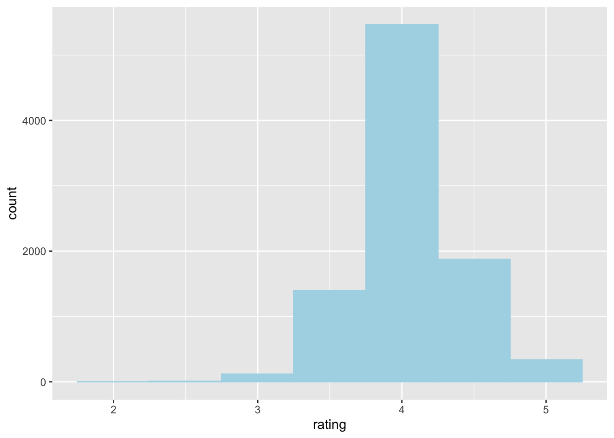

# Histograms

*Written by Haoluan Chen and last updated on 7 October 2021.*

## Introduction

{width=400 height=300}

In this lesson, you will learn how to:

- Create a histogram in R using ggplot2 package

- Customize your histogram

Prerequisite skills include:

- Install and load ggplot2 packages

- Basics of using ggplot2: e.g. `ggplot()`, `aes()`.

Highlights:

- Create a histogram with a real dataset

## Making and customizing histograms

### What is a histogram?

A histogram is a visual representation of the distribution of numerical data. It allows you to easily see where your data is concentrated and the variation of the data. It can help visually answer questions like:

* what values in the dataset appear most often?
* what is the range of values found in my data?

Here, we have a book dataset from Alex Cookson. This dataset contains 9,000 children's books that have been rated from 1-5 stars. 


```r
books <- read_tsv("https://raw.githubusercontent.com/tacookson/data/master/childrens-book-ratings/childrens-books.txt")
#> Rows: 9240 Columns: 15
#> ── Column specification ────────────────────────────────────
#> Delimiter: "\t"
#> chr  (5): isbn, title, author, cover, publisher
#> dbl (10): pages, original_publish_year, publish_year, ra...
#> 
#> ℹ Use `spec()` to retrieve the full column specification for this data.
#> ℹ Specify the column types or set `show_col_types = FALSE` to quiet this message.
```

We can see that `rating` is a numerical variable, so we can create a histogram to visualize the rating distribution. 

Using the following code, we can create our first and simplest histogram in R!


```r
books %>% 
  ggplot(aes(rating)) + 
  geom_histogram()
#> `stat_bin()` using `bins = 30`. Pick better value with
#> `binwidth`.
#> Warning: Removed 37 rows containing non-finite values
#> (stat_bin).
```


For the histogram it only requires one numeric variable as input (`rating` in this case). The function `geom_histogram()` automatically counts the number of numerical values that lie within specific ranges, called bins. Bins are defined by their lower bounds (inclusive); the upper bound is the lower bound of the next bin. 

Looking at the histogram above, we can see that the x-axis (`rating`) is divided into small blocks (bins) and the y-axis represents the number if observations lie within that block. The warning is telling you there is missing values in the rating. We can ignore this for now.


### Other Optional Arguments

In the geom_histogram function, we can adjust our bins' size, titles of the histogram, and color of our histogram. 

#### Bin size

We can adjust the bin size of our histogram by setting the optional parameter binwidth. 


```r
books %>% 
  ggplot(aes(rating)) + 
  geom_histogram(binwidth = 1)
#> Warning: Removed 37 rows containing non-finite values
#> (stat_bin).
```


Here, I am setting the bin width equal to 1. This means that we divide the rating into bins of range 1. In this case, we have a bin with range [2.5,3.5), [3.5,4.5), and [4.5,5.5). Then, we count the number of ratings that lies within this range. From the above histogram, we can see that there is about 8000 books lies within the range of [3,4).

Without specifying the binwidth, geom_histogram will automatically find an optimal binwidth. 
 

#### Color and fill


```r
books %>% 
  ggplot(aes(rating)) + 
  geom_histogram(color ="red", fill = "light blue")
#> `stat_bin()` using `bins = 30`. Pick better value with
#> `binwidth`.
#> Warning: Removed 37 rows containing non-finite values
#> (stat_bin).
```


The color parameter specify the color of the boundary of each bin and the fill parameter specify the color of the bin. You can create change the color of your histogram to make more unique and appealing.

#### Title, and name of the axes

Using the `labs()` function in ggplot2 we can change the title and the name of the axes. 

```r
books %>% 
  ggplot(aes(rating)) + 
  geom_histogram(color ="red", fill = "light blue") +
  labs(title = "A historgram of children's book rating", 
       x = "Book rating", y = "Number of books")
#> `stat_bin()` using `bins = 30`. Pick better value with
#> `binwidth`.
#> Warning: Removed 37 rows containing non-finite values
#> (stat_bin).
```


In the `labs()` function, `title` specifies the title of your plot, `x` specifies the name of the x-axis and `y` specifies the name of the y-axis.  


## Exercises

### Exercise 1

Please create a histogram for the ratings of the books that are published in 2010
**Hint: `filter()` in `dplyr` package maybe helpful**


### Exercise 2

Please change the bin width of your histogram in Exercise 1 to 0.2


### Exercise 3

Please change the colour and the fill of your histogram in Exercise 1 
You can choose any colour you like from this website: https://www.rapidtables.com/web/color/RGB_Color.html
You may use the colour name or the Hex code provided in the website.


### Exercise 4


```
#> Warning: Removed 37 rows containing non-finite values
#> (stat_bin).
```




<!-- ```{r ex4, echo = FALSE} -->
<!-- question("Which of the following code can produce above histogram? (Try to run the code on your computer!)", -->
<!--           answer("geom_histogram(binwidth = 0.1, color = 'light blue')"), -->
<!--           answer("books %>% ggplot(aes(rating)) + geom_histogram(binwidth = 0.5, color = 'light blue')"), -->
<!--           answer("books %>% ggplot(aes(rating)) + geom_histogram(binwidth = 0.5, color = 'light blue', fill = 'light blue')", correct = TRUE), -->
<!--           answer("books %>% ggplot(aes(rating)) + geom_histogram(binwidth = 0.1, color = 'light blue', fill = 'light blue')"), -->
<!--           allow_retry = TRUE) -->

<!-- ``` -->


### Video Solutions


## Common Mistakes & Errors

- Make sure your input variable is a numeric variable.
- Make sure you are using `+` to connect the `ggplot()` and `geom_histogram()`, not the pipe operator `%>%` 
- Check you have closed all the bracket

## Next Steps

For next step, you can customize your histogram with different colour, labels and change the line types. You can find examples in this website: http://www.sthda.com/english/wiki/ggplot2-histogram-plot-quick-start-guide-r-software-and-data-visualization

In this website https://www.r-graph-gallery.com/histogram.html, you can find different types of histogram you can make in R it has codes that you can follow along. On the main page, there are many other types of visual representations you can build in R, such as box plot and scatter plot:https://www.r-graph-gallery.com/index.html 


## Exercises

### Question 1

### Question 2

### Question 3

### Question 4

### Question 5

### Question 6

### Question 7

### Question 8

### Question 9

### Question 10
