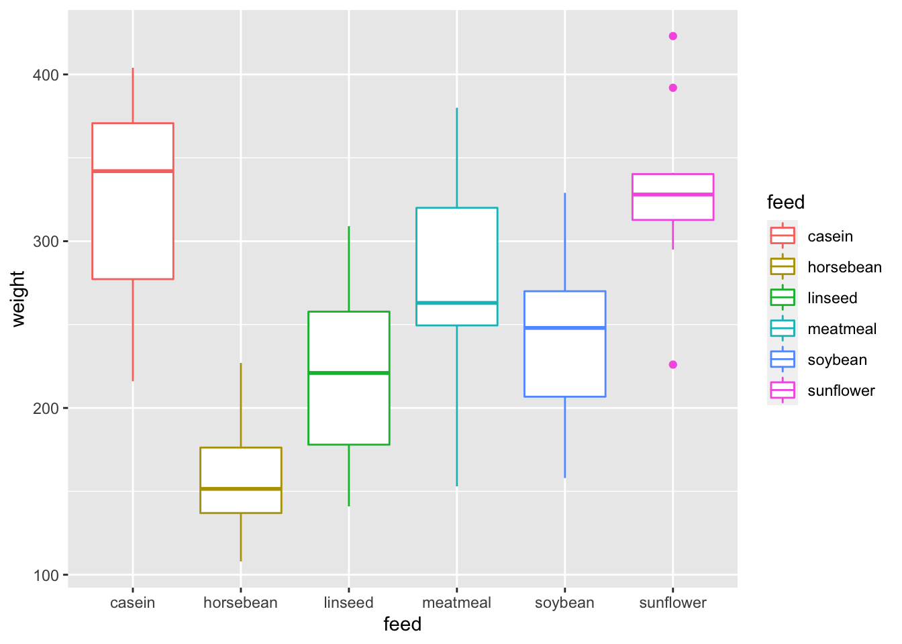
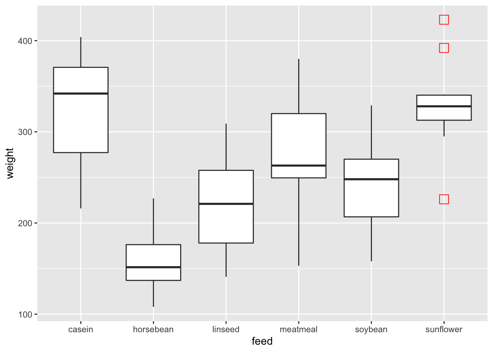
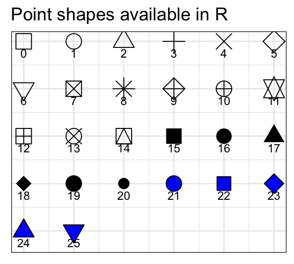
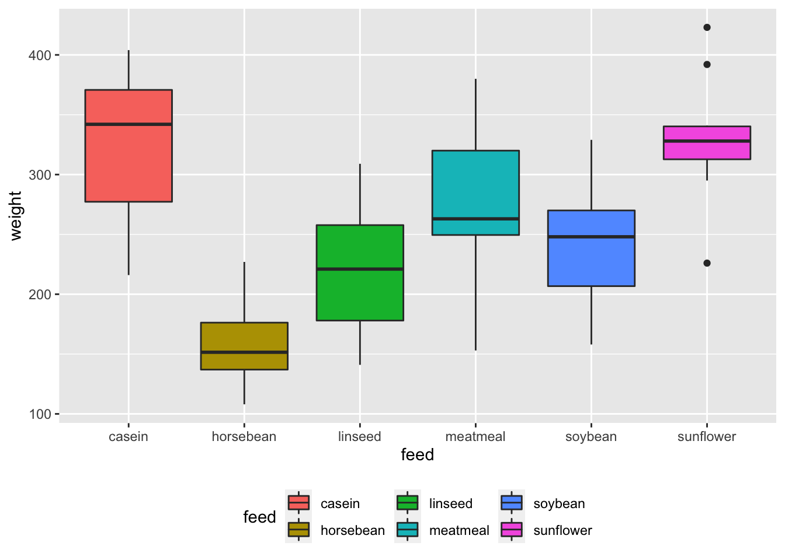
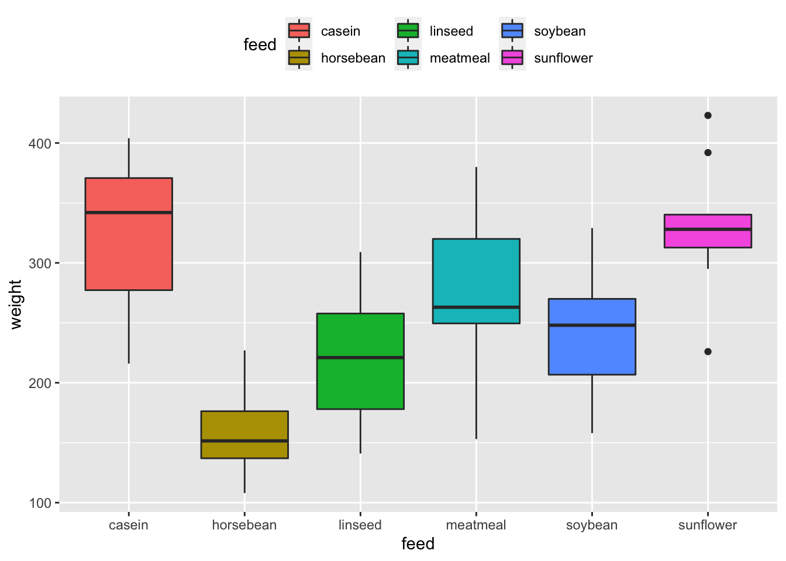
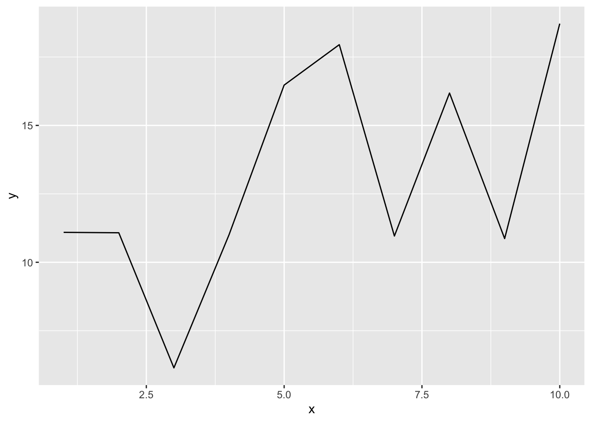
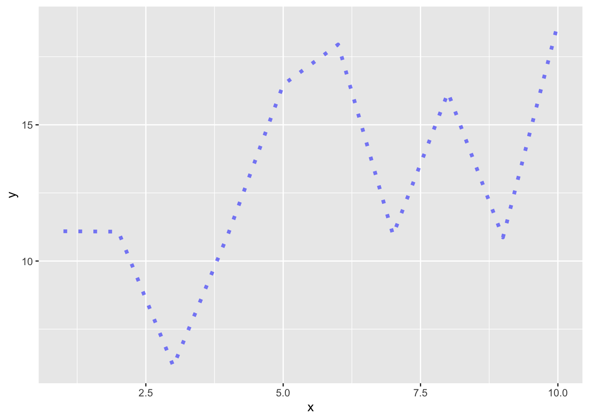

# Some other geom

*Written by Ruijia Yang and last updated on January 30, 2022.*

## Introduction
{width=400 height=300}


In this lesson, you will learn how to:

- Plot box-plot and line-plot using the `ggplot` package


Prerequisite skills include:

- Having `ggplot` installed and loaded
- Basic familiarity with `ggplot`

Highlights:

- Customize your plots box-plots and line-plots.


## The content

### box-plot
A box-plot is a visual representation of the distribution of numerical data. It allows you to easily see where your data is concentrated and the variation of the data based on the minimum, the maximum, the sample median, and the first and third quartiles. Additionally, it can be used to compare the variation between different groups.


Here we have a builted in dataset called `chickwts`. This dataset contains 71 observations and 2 variable: weight and feed. The variable weight is a numeric variable giving the chick weigh, and variable feed is a factor giving the feed type. 


```r
chickwts
#>    weight      feed
#> 1     179 horsebean
#> 2     160 horsebean
#> 3     136 horsebean
#> 4     227 horsebean
#> 5     217 horsebean
#> 6     168 horsebean
#> 7     108 horsebean
#> 8     124 horsebean
#> 9     143 horsebean
#> 10    140 horsebean
#> 11    309   linseed
#> 12    229   linseed
#> 13    181   linseed
#> 14    141   linseed
#> 15    260   linseed
#> 16    203   linseed
#> 17    148   linseed
#> 18    169   linseed
#> 19    213   linseed
#> 20    257   linseed
#> 21    244   linseed
#> 22    271   linseed
#> 23    243   soybean
#> 24    230   soybean
#> 25    248   soybean
#> 26    327   soybean
#> 27    329   soybean
#> 28    250   soybean
#> 29    193   soybean
#> 30    271   soybean
#> 31    316   soybean
#> 32    267   soybean
#> 33    199   soybean
#> 34    171   soybean
#> 35    158   soybean
#> 36    248   soybean
#> 37    423 sunflower
#> 38    340 sunflower
#> 39    392 sunflower
#> 40    339 sunflower
#> 41    341 sunflower
#> 42    226 sunflower
#> 43    320 sunflower
#> 44    295 sunflower
#> 45    334 sunflower
#> 46    322 sunflower
#> 47    297 sunflower
#> 48    318 sunflower
#> 49    325  meatmeal
#> 50    257  meatmeal
#> 51    303  meatmeal
#> 52    315  meatmeal
#> 53    380  meatmeal
#> 54    153  meatmeal
#> 55    263  meatmeal
#> 56    242  meatmeal
#> 57    206  meatmeal
#> 58    344  meatmeal
#> 59    258  meatmeal
#> 60    368    casein
#> 61    390    casein
#> 62    379    casein
#> 63    260    casein
#> 64    404    casein
#> 65    318    casein
#> 66    352    casein
#> 67    359    casein
#> 68    216    casein
#> 69    222    casein
#> 70    283    casein
#> 71    332    casein
```


To create a box-plot, we simply input a factor variable as x and a numerical variable as y when we specify the aesthetic mappings in `ggplot()`. Then we tell R to generate a box-plot by adding a `gemo_boxplot()` layer.  


```r
chickwts %>% ggplot(aes(x = feed, y = weight)) + 
  geom_boxplot()
```


#### Arguments

##### Change box plot colors

We can change the box-plot line colors by adding a color parameter in `ggplot()`

```r
chickwts %>% ggplot(aes(x = feed, y = weight, color = feed)) + 
  geom_boxplot()
```



Or we can also change the fill color by specifying fill parameter in `ggplot()`

```r
chickwts %>% ggplot(aes(x = feed, y = weight, fill = feed)) + 
  geom_boxplot()
```


Using colors adds more contrast between different groups.


##### Change outlier color, shape and size
In `geom_boxplot()`, we can change the color, shape and size for the outliers to make it more stand out.

```r
chickwts %>% ggplot(aes(x = feed, y = weight)) + 
  geom_boxplot(outlier.colour="red", outlier.shape=8,
                outlier.size=4)
```


To change the shape of the outlier to a square, we can specify `outlier.shape = 0`

```r
chickwts %>% ggplot(aes(x = feed, y = weight)) + 
  geom_boxplot(outlier.colour="red", outlier.shape=0,
                outlier.size=4)
```






##### Legends Locations

If you want to hide the legend, you may do so by specify `show.legend = F` 

```r
chickwts %>% ggplot(aes(x = feed, y = weight, fill = feed)) + 
  geom_boxplot(show.legend = F)
```


Or if you want to change the legend position, you may add a theme layer and specify `theme(legend.position="bottom")` or `theme(legend.position="top")`. 


```r
chickwts %>% ggplot(aes(x = feed, y = weight, fill = feed)) + 
  geom_boxplot() + theme(legend.position="bottom")
```



```r
chickwts %>% ggplot(aes(x = feed, y = weight, fill = feed)) + 
  geom_boxplot() + theme(legend.position="top")
```




```r
chickwts %>% ggplot(aes(x = feed, y = weight, fill = feed)) + 
  geom_boxplot(show.legend = F)
```


### Line plot
A line plot is very similar to a scatter plot except that the measurement points are ordered(usually by their x-axis value) and joined with straight line segments. It is often used to show a trend in the your data over a time interval. 

The input data frame requires 2 columns:

- An ordered numeric variable for the X axis
- Another numeric variable for the Y axis

Here is a basic line plot:


```r
set.seed(10)
# Generate x and y
x <- 1:10
y <- x + rnorm(10, 10, 5)
data <- data.frame(x,y)

# Plot
data %>% ggplot(aes(x, y)) + 
  geom_line()
```



We can also plot multiple lines on the plot to compare the trends between different variable.

In `ggplot2` package, there is a dataset called economics_long. It contains a date variable, a variable describing the economic statistics such as total population and unemployment count, and its value. 


```r
economics_long
#> # A tibble: 2,870 × 4
#>    date       variable value  value01
#>    <date>     <chr>    <dbl>    <dbl>
#>  1 1967-07-01 pce       507. 0       
#>  2 1967-08-01 pce       510. 0.000265
#>  3 1967-09-01 pce       516. 0.000762
#>  4 1967-10-01 pce       512. 0.000471
#>  5 1967-11-01 pce       517. 0.000916
#>  6 1967-12-01 pce       525. 0.00157 
#>  7 1968-01-01 pce       531. 0.00207 
#>  8 1968-02-01 pce       534. 0.00230 
#>  9 1968-03-01 pce       544. 0.00322 
#> 10 1968-04-01 pce       544  0.00319 
#> # … with 2,860 more rows
```


```r
ggplot(economics_long, aes(date, value01, color = variable)) +
  geom_line()
```


Notice that we added `color = variable` to differentiate between different economic statistic. 


##### Arguments

`geom_line()` has several optional arguments to customize the line plot.

`color`: A string specify the Color of the line
`size`: a number specify the  Size of the line 
`alpha`: a number from (0,1] specify the transparency of the line, lower value means more transparent
`linetype`: line type can be specified using either text (“blank”, “solid”, “dashed”, “dotted”, “dotdash”, “longdash”, “twodash”) or number (0, 1, 2, 3, 4, 5, 6). Note that `linetype = “solid”` is identical to `linetype=1`.


```r
data %>% ggplot(aes(x, y)) + 
  geom_line(color="blue", size=1.5, alpha=0.5, linetype="dotted")
```




## Exercises

### Question 1
If I have categorical data and numerical data, which geom should I use to plot it (pick one)?

    a. `geom_point()`
    b. `geom_histogram()`
    c. `geom_bar()`
    d.   `geom_boxplot()`


### Question 2
"A time series is a sequence of data points that occur in successive order over some period of time." What can we use to plot time-series data?

    a.   `geom_line()`
    b. `geom_histogram()`
    c. `geom_bar()`
    d. `geom_boxplot()`


### Question 3
You need an ordered numeric variable for the X axis for line plot.

    a.  True
    b. False


### Question 4
Is `alpha` a parameter for `geom_boxplot()`?(Hint: use `?geom_boxplot` in the console)

    a. True
    b.  False

### Question 5
What can we do to customize our box-plot? (Multiple answers)

    a.  size of the outliner
    b.  color 
    c. line type
    d.  legend position


### Question 6
What can we do to customize our line-plot?

    a. size
    b. color 
    c. line type
    d. transparency
    e.  All of the above


### Question 7
What does the parameter `alpha` do in line plot?

    a. Change the size
    b. Change the line type 
    c.  Change the transparency of the line
    d. It is not a parameter in line plot
    
### Question 8
What does the parameter `alpha` do in box-plot?

    a. Change the size
    b. Change the line type 
    c. Change the transparency of the line
    d.  It is not a parameter in box-plot

### Question 9
Which of the following code that can move the legend to the top for box-plot?

    a. add a `theme(legend.position="top")` layer
    b. add `legend.position="top"` in `geom_boxplot()`
    c. add `show.legend = T"` in `geom_boxplot()`
    d. You cannot do that in box-plot

### Question 10
What does `color` parameter do in `ggplot()` for boxplot?

    a. Change line color for boxplot
    b. Change fill color for boxplot
    c. Change outliner color in boxplot
    d. Change background color for boxplot


## Common Mistakes & Errors
- When connecting `ggplot()` to `geom_boxplot()` and `geom_line()` make sure you use a plus sign (+) instead of the pipe operator. 
- For box-plot, make sure you have at least one numerical variable on the y-axis
- For line plot, make sure you have an ordered numeric variable for the x-axis and another numeric variable for the y-axis

## Next Steps
In this website https://www.r-graph-gallery.com/histogram.html, you can find different types of boxplot and line plot you can make in R. It has codes that you can follow along. On the main page, there are many other types of visual representations you can build in R, such as box plot and scatter plot:https://www.r-graph-gallery.com/index.html 

Here is a tutorial to produce scatter plots, boxplots, and time series plots using ggplot. Additioanlly, it talks about faceting, themes, arranging plots and exporting plots. https://datacarpentry.org/R-ecology-lesson/04-visualization-ggplot2.html#Boxplot


