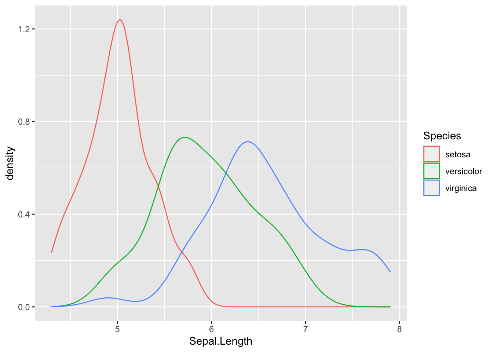
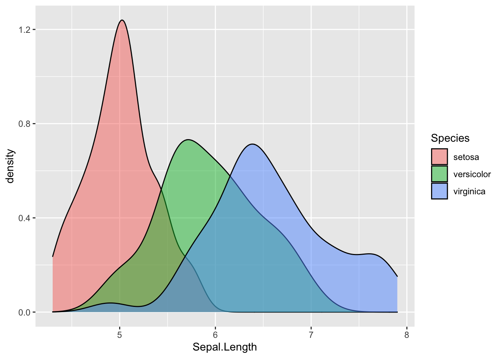
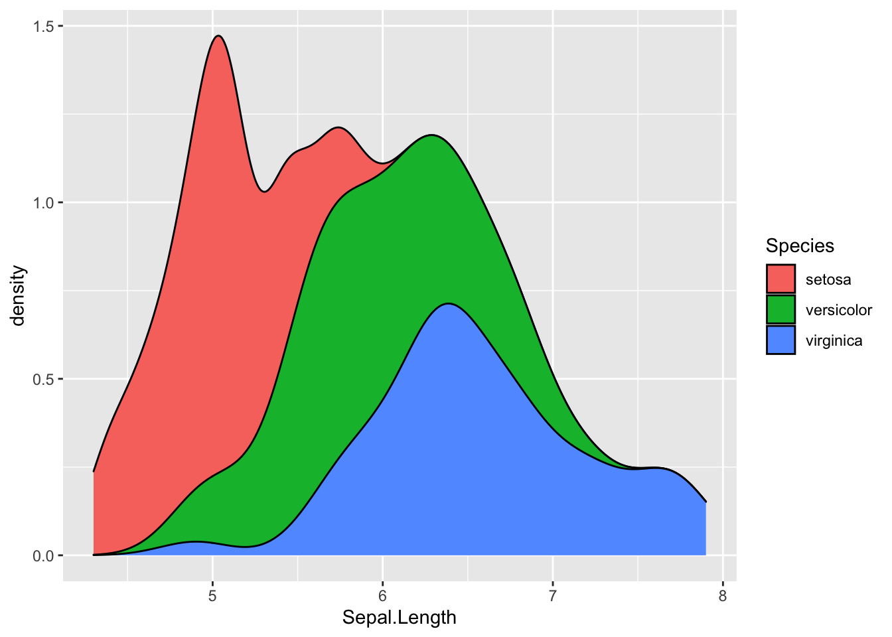
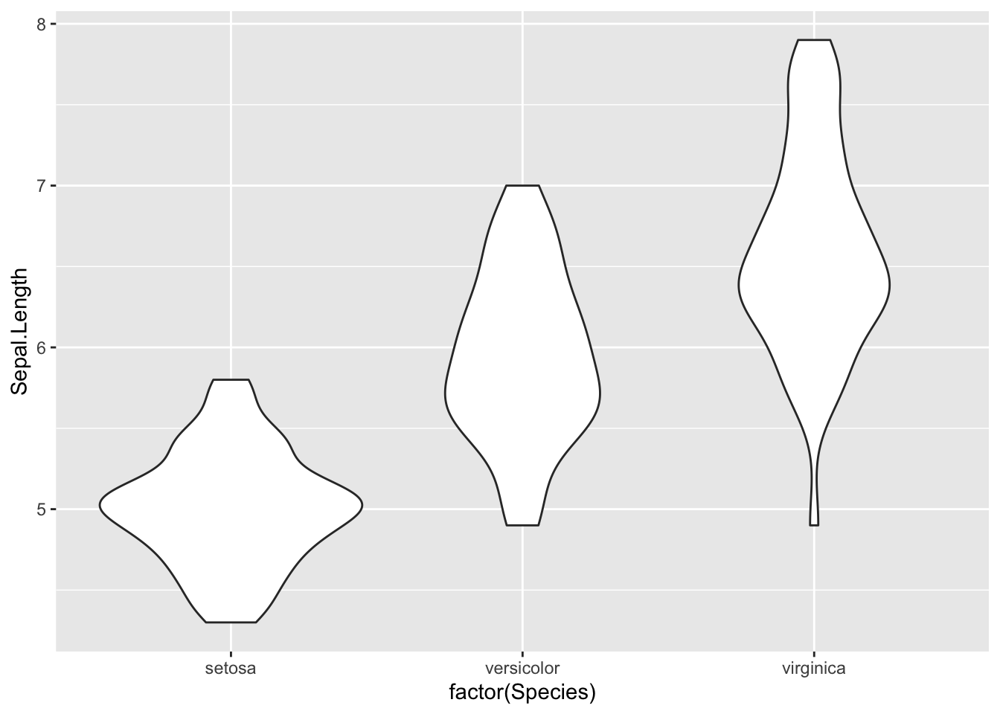
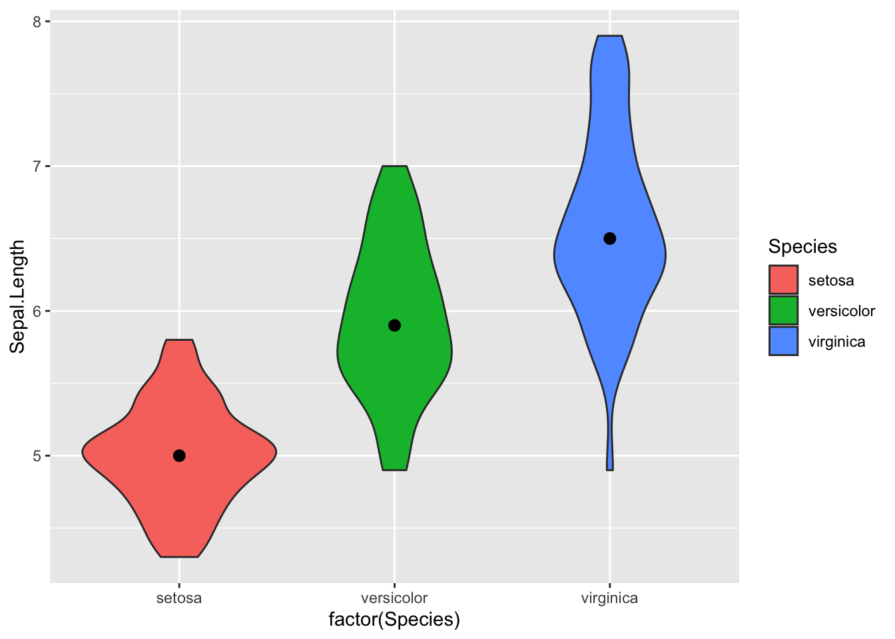
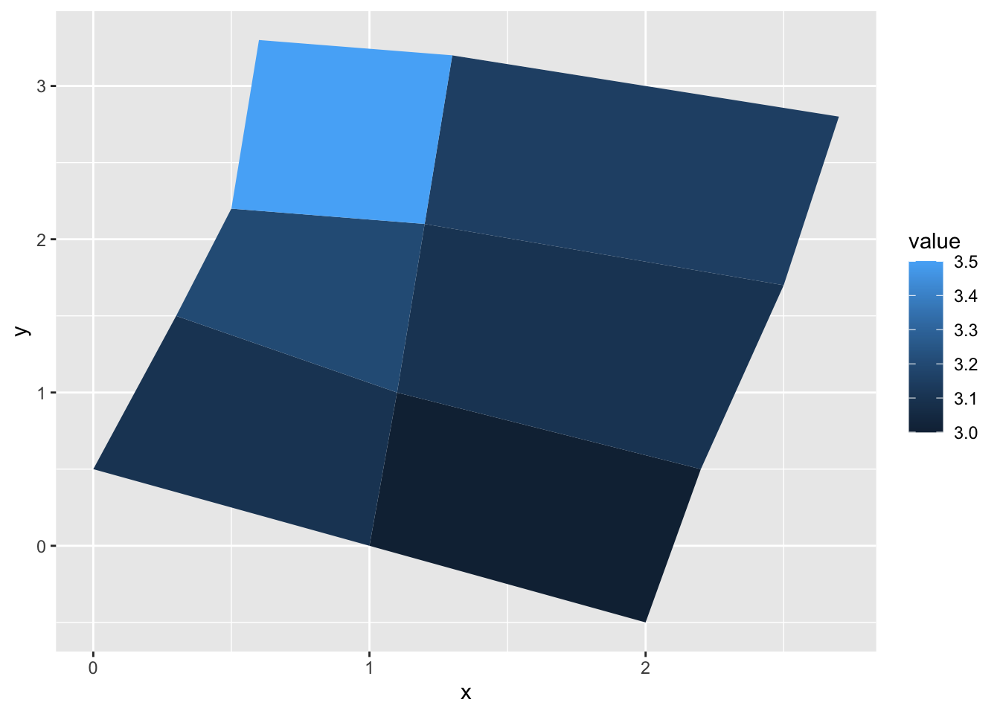

# other geoms 2


*Written by Ananya Jha and last updated on 5 February 2022*

## Introduction

Ggplot2 is powerful package that offers a wide variety of functions and options to produce graphics. So far, we have covered some important and useful individual geoms. In this lesson we will be talking about some other individual geoms that are used to create the basic layers of data.


In this lesson, you will learn how to:

- Create interesting graphics such as density plots, polygons, violin plots, and rectangles using `geom_density()`, `geom_polygon()`, `geom_violin()`, and `geom_rect()`.
- Use `geom_polygon()` to create basic maps using the data from maps package
-  Differentiate between and know the correct use cases of the three different rectangle functions: `geom_raster()`, `geom_rect()`, and `geom_tile()`.


Prerequisites:

- Having the most updated version of the `ggplot2` and `maps` package installed and loaded 
- Basic understanding of `ggplot2` and experience working with the basic functions and aesthetics such as: fill, factor() etc.

Let's first try to understand what these geoms are and take a quick look at their function definitions: 

## Density Plots 

A Density plot(or Kernel density plot) is used to display the distribution of a numeric variable and can be created using the `geom_density()` function in R. It is similar to the histogram for continuous data but gives a smoothed version of the graph. 

geom_density(mapping = NULL,  data = NULL,  stat = "density",  position = "identity",  ...,  na.rm = FALSE,  orientation = NA,  show.legend = NA,  inherit.aes = TRUE,  outline.type = "upper")

Where:

| **Argument** | **Details**                                                                                                                      |
|:------------:|:--------------------------------------------------------------------------------------------------------------------------------:|
| mapping      | Set of aesthethic mappings created by aes(). By default, it is combined with the mapping specified in the top layer of the plot. |
| data         | The data to be dispayed. If not specified, inherited directly from top layer.                                                    |
| stat         | The statistical transformation to use on the data for this layer, as a string.                                                   |
| position     | The position adjustment. Is "identity" by default for density plots.                                                             |
| ...          | Other optional arguments(like aesthetics such as color/size etc.)                                                                |
| na.rm        | Can be used to remove missing values without a warning. Is FALSE by default.                                                     |
| orientation  | By default, orientation would follow from aesthetic mapping but to change manually you can set this to "x" or "y"                |
| show.legend  | Set this to TRUE to include legend. Is NA by default which woulde include if aesthetics are mapped.                              |


## Violin Plots

Violin plots can be thought of as a hybrid of the box plot and kernel density plot.  They are used with numerical data to display the distribution and the summary statistics. In R, violin plots can be created with the `geom_violin()` function.


geom_violin(mapping = NULL,  data = NULL,  stat = "ydensity",  position = "dodge",  ...,  draw_quantiles = NULL,  trim = TRUE,  scale = "area",  na.rm = FALSE,  orientation = NA,  show.legend = NA,  inherit.aes = TRUE)
 
Where:
 
| **Argument**   | **Details**                                                                                                                                              |
|:--------------:|:--------------------------------------------------------------------------------------------------------------------------------------------------------:|
| mapping        | Set of aesthethic mappings created by aes(). By default, it is combined with the mapping specified in the top layer of the plot.                         |
| data           | The data to be displayed. If not specified, inherited directly from top layer.                                                                           |
| stat           | The statistical transformation to use on the data for this layer, as a string.                                                                           |
| position       | The position adjustment. Is "dodge" by default for violin plots                                                                                          |
| draw_quantiles | Set to not(NULL) to draw lines to indicate quantiles                                                                                                     |
| trim           | Set to FALSE to not trim the tails to match the range of data                                                                                            |
| scale          | By default all violins will have the same area. Set to "count" to scale to number of observations or to "width" to make all violins have same max width  |
| ...            | Other optional arguments(like aesthetics such as color/size etc.)                                                                                        |
| na.rm          | Can be used to remove missing values without a warning. Is FALSE by default.                                                                             |
| orientation    | By default, orientation would follow from aesthetic mapping but to change manually you can set this to "x" or "y"                                        |
| show.legend    | Set this to TRUE to include legend. Is NA by default which woulde include if aesthetics are mapped.                                                      |
| inherit.aes    | Set this to FALSE to override default aesthetics inherited from the first layer                                                                          |

## Polygons

To draw polygons, which can also be thought of as filled paths(more on this later), we use the geom_polygon() function. The function generally requires 2 data frames- one for the polygon coordinates(positions) and one for the values of each polygon(values).
Polygons are considered very useful when working with map/spatial data or when you wish to layer simple polygons over other plots.

geom_polygon(mapping = NULL,  data = NULL,  stat = "identity",  position = "identity",  rule = "evenodd", 
...,  na.rm = FALSE,  show.legend = NA,  inherit.aes = TRUE)

Where:

| **Argument** | **Details**                                                                                                                      |
|:------------:|:--------------------------------------------------------------------------------------------------------------------------------:|
| mapping      | Set of aesthetic mappings created by aes(). By default, it is combined with the mapping specified in the top layer of the plot. |
| data         | The data to be displayed. If not specified, inherited directly from top layer.                                                    |
| stat         | The statistical transformation to use on the data for this layer, as a string.                                                   |
| position     | The position adjustment. Is "identity" by default for polygons.                                                                  |
| ...          | Other optional arguments(like aesthetics such as color/size etc.)                                                                |
| na.rm        | Can be used to remove missing values without a warning. Is FALSE by default.                                                     |
| show.legend  | Set this to TRUE to include legend. Is NA by default which woulde include if aesthetics are mapped.                              |
| inherit.aes  | Set this to FALSE to override default aesthetics inherited from the first layer.                                                 |


## Rectangles

Rectangles are mainly used to draw surfaces on plots but sometimes we might want to draw random rectangles as well. 
As mentioned previously, there are 3 different functions in R that can be used to graph rectangles. We will be exploring the differences between these later. 

geom_raster(mapping = NULL,  data = NULL,  stat = "identity",  position = "identity",  ...,  hjust = 0.5,  vjust = 0.5,  interpolate = FALSE,  na.rm = FALSE,  show.legend = NA,  inherit.aes = TRUE)

geom_rect(mapping = NULL,  data = NULL,  stat = "identity",  position = "identity",  ...,  linejoin = "mitre",  na.rm = FALSE,  show.legend = NA, inherit.aes = TRUE)
  
geom_tile(mapping = NULL, data = NULL,  stat = "identity",  position = "identity",  ...,  linejoin = "mitre",  na.rm = FALSE,  show.legend = NA,  inherit.aes = TRUE)

Where:

| **Function(s)**                         | **Argument** | **Details**                                                                                                                        |
|:---------------------------------------:|:------------:|:----------------------------------------------------------------------------------------------------------------------------------:|
| geom_raster(), geom_rect(), geom_tile() | mapping      | Set of aesthetic mappings created by aes(). By default, it is combined with the mapping specified in the top layer of the plot.   |
| geom_raster(), geom_rect(), geom_tile() | data         | The data to be displayed. If not specified, inherited directly from top layer.                                                      |
| geom_raster(), geom_rect(), geom_tile() | stat         | The statistical transformation to use on the data for this layer, as a string.                                                     |
| geom_raster(), geom_rect(), geom_tile() | position     | The position adjustment. Is "identity" by default for rectangles.                                                                   |
| geom_raster(), geom_rect(), geom_tile() | ...          | Other optional arguments(like aesthetics such as color/size etc.)                                                                  |
| geom_raster()                           | hjust, vjust | Horizontal and Vertical justification for the plot(can be between 0-1). 0 would mean left-justified and 1 would be right-justified |
| geom_raster()                           | interpolate  | Set this to TRUE to get a smoothed output                                                                                          |
| geom_raster(), geom_rect(), geom_tile() | linejoin     | The line join style preferred                                                                                                      |
| geom_raster(), geom_rect(), geom_tile() | na.rm        | Can be used to remove missing values without a warning. Is FALSE by default.                                                       |


# Examples

Now that we have covered the basics of these geoms, let's take a look at a few examples and use cases of these geoms to see how they work: 

## Density Plots

Let's use the `iris` data set from R to explore the distribution of sepal widths using the density plot.
We can first create a basic density plot:

```r
ggplot(iris, aes(x=Sepal.Length)) +geom_density()
```


We can also overlay the density plots for different species:

```r
ggplot(iris, aes(x = Sepal.Length)) + geom_density(aes(color = Species))
```


This can be useful when comparing distributions for any variable. 

We can also customize the density plots by using `linetype="dashed"` or fill colors. A useful option would be to use partial fill in case you want to be able to see the background like this:

```r
ggplot(iris, aes(x=Sepal.Length)) + geom_density(aes(fill=Species), alpha=0.5)
```


You can also create stacked density plots using the position argument :

```r
ggplot(iris, aes(x=Sepal.Length)) + geom_density(aes(fill=Species), position = "stack")
```


**Note**- Density plots can also be created using baser functions but are much easier to customize and provides more options if made using `ggplot2`.

## Violin Plots

Violin plots capture the best of box plots and density plots- they are both aesthetically pleasing and easy to interpret. Just as box plots, violin plots make comparing data very easy and at the same time, show the variations in data.

We will again use the `iris` data set, but this time we will compare Sepal widths using violin plots. We will have to use Species as a factor to create separate plots for the different species.


```r
ggplot(iris, aes(factor(Species), Sepal.Length)) + geom_violin()
```


We can use `coord_flip` to rotate the plot:

```r
ggplot(iris, aes(factor(Species), Sepal.Length)) + geom_violin() + coord_flip()
```


Just like density plots, you can make these more aesthetic by using fill:

```r
ggplot(iris, aes(factor(Species), Sepal.Length)) + geom_violin(aes(fill=Species))
```


You can also show quartiles on these plots by using the `draw_quantiles` argument:

```r
ggplot(iris, aes(factor(Species), Sepal.Length)) + geom_violin(aes(fill=Species), draw_quantiles = c(0.25, 0.5, 0.75))
```


If you want to be more specific and want to show summary statistics on the violin plot itself, you can add that too:


```r
#To show the mean
ggplot(iris, aes(factor(Species), Sepal.Length)) + geom_violin(aes(fill=Species)) + stat_summary(fun = mean)
```


```r
#To plot the median
ggplot(iris, aes(factor(Species), Sepal.Length)) + geom_violin(aes(fill=Species)) + stat_summary(fun = median)
```



Note: Violin plots can be customized in a variety of ways including adding boxplots over the violin plot(using +geom_boxplot()) or adding points (using `+ geom_dotplot()` or `+ geom_jitter()`). The latter  is especially useful for analyzing outliers.


## Polygons

Polygons are extremely useful when working with map or geospatial data. They can be thought of as `geom_path()` with connected start and end points and are colored inside(using the "fill" aesthetic property).

Since we are creating random polygons, we will first start by building our data. This code block to create the data has been sourced directly from the `ggplot2` documentation website.

We have to create the two data frames- one containing the coordinates and another one containing the values for each respective polygon. These two would be linked using a third "id" column.


```r
ids <- factor(c("1.1", "2.1", "1.2", "2.2", "1.3", "2.3"))

values <- data.frame(
  id = ids,
  value = c(3, 3.1, 3.1, 3.2, 3.15, 3.5)
)
```

Now we can create the positions data frame :

```r
positions <- data.frame(
  id = rep(ids, each = 4),
  x = c(2, 1, 1.1, 2.2, 1, 0, 0.3, 1.1, 2.2, 1.1, 1.2, 2.5, 1.1, 0.3,
  0.5, 1.2, 2.5, 1.2, 1.3, 2.7, 1.2, 0.5, 0.6, 1.3),
  y = c(-0.5, 0, 1, 0.5, 0, 0.5, 1.5, 1, 0.5, 1, 2.1, 1.7, 1, 1.5,
  2.2, 2.1, 1.7, 2.1, 3.2, 2.8, 2.1, 2.2, 3.3, 3.2)
)
```

The next step would be to merge the two(the polygon coordinates and values) to create our final data to be plotted:

```r
data<- merge(values, positions, by=c("id"))
```
Finally, we can plot the polygon using `geom_polygon()`. Note that we use the `group` aesthetic to tell R which coordinates we want grouped together to form a polygon.

```r
ggplot(data, aes(x=x, y=y)) + geom_polygon(aes(fill=value, group=id))
```


Now that we know how to create simple, basic polygons, we can take a look at drawing maps using `geom_polygon()` by drawing boundaries for regions.

We can take the data from the maps package in R. We will use the `map_data()` function to turn the data into a data frame. Right now we are only concerned with the counties in New York so we will pick those regions. 


```r
df <- map_data("county", "new york") %>% 
  select(long , lat, group, id = subregion)
head(df)
#>        long      lat group     id
#> 1 -73.78550 42.46763     1 albany
#> 2 -74.25533 42.41034     1 albany
#> 3 -74.25533 42.41034     1 albany
#> 4 -74.27252 42.41607     1 albany
#> 5 -74.24960 42.46763     1 albany
#> 6 -74.22668 42.50774     1 albany
```

We extracted 4 variables from the package- 
- long(the longitude) and lat(the latitude) which will be considered vertices of the polygon 
- id which contains the names of these regions
- groups which identifies grouped regions(if a region is covered over multiple islands)

Lets take a quick look at the data by making a scatter plot. This will plot the vertices(corner) of each polygon(so counties in this case). 

```r
ggplot(df, aes(long, lat)) + 
  geom_point() 
```


Finally we can turn it into a map by using geom_polygon() like this:

```r

ggplot(df, aes(long, lat, group = group)) +
  geom_polygon(fill = "lightblue", colour = "blue2") 
```


## Rectangles

First, we will start by creating random rectangles with `geom_tile()`. 

We will need an arbitrary data frame to parameterize the rectangle with the center of tile and size. The section of code used to construct the data frames has been sourced directly from the documentation page for `geom_tile`.

```r
df <- data.frame(
  x = c(3, 1, 5, 7, 9), 
  y = c(2, 4, 6, 8, 10), 
  z = factor(rep(1:5)), 
  w = rep(c(1, 6), each = 5)
)
```
Then we can plot it:

```r
ggplot(df, aes(x, y)) + geom_tile(aes(fill = z))
```


Or if we use `geom_rect`, we will have to use the four corners of the rectangle(xmin, xmax, ymin, ymax) as the parameters instead.

```r
ggplot(df, aes(xmin = x - w / 2, xmax = x + w / 2, ymin = y, ymax = y + 1)) + geom_rect(aes(fill = z))
```


Finally, `geom_raster` is the most ideal when all tiles are of the same size and is considered much faster performance wise. We can use it to create a surface like this:


```r
df <- expand.grid(x = 0:5, y = 0:5)
z <- factor(rep(1:5))
df$z <- runif(nrow(df))
ggplot(df, aes(x, y, fill = z)) + geom_raster()
```


We can also use `interpolate=TRUE` to smooth the surface (which is more useful when the goal is to render images)


```r
ggplot(df, aes(x, y, fill = z)) + geom_raster(interpolate = TRUE)
```


The most common use of rectangles is to create surfaces or with map data or heat maps.


# Exercises

Test out your knowledge by trying these simple exercises:

# Exercise 1

Create a stacked Density plot using the `ToothGrowth` data set to observe the varying distribution of tooth lengths according to the dose supplied(as a factor). You would want to use the `len` variable as an aesthetic and fill with `factor(dose)`. Make sure the plot is stacked by specifying `position=stack` in the `geom_density` layer.


```r
ggplot(ToothGrowth, aes(len, fill = factor(dose))) +
  geom_density(position = "stack")
```


# Exercise 2

Use the `mtcars` data set in R to create a violin plot of the Number of cylinders (`cyl`) as a factor vs Miles/ gallon (`mpg`) and add a layer of jitters(using `geom_jitter`). Fill the plot with `cyl` as a factor and color the jitters black.


```r
ggplot(mtcars, aes(factor(cyl), mpg)) + geom_violin(aes(fill=factor(cyl))) + geom_jitter(color = 'black')
```


# Exercise 3 

Following the steps above, use the `maps` package and the `map_data()` function in R to create a map of all counties of California using `geom_polygon()`. Border the map with red color and fill with pink inside. 


```r
df <- map_data("county", "california") %>% 
  select(long , lat, group, id = subregion)
ggplot(df, aes(long, lat, group = group)) +
  geom_polygon(fill = "pink", colour = "red") 
```


# Exercise 4

Use the `faithfuld` data set in R to plot `waiting` vs `eruptions` and add a layer of rectangles(to create a heat map) using the most high performing function(out of the three that we covered). Add density as the fill aesthetic and smooth out the graph. 


```r
ggplot(faithfuld, aes(waiting, eruptions)) +
 geom_raster(aes(fill = density), interpolate = TRUE) 
```


## Common mistakes and errors

- When dealing with violin plots you may get a warning such as "Warning: Removed 3 rows containing missing values (geom_segment)." This is due to the way ggplot2 deals with out of range axes and can be fixed using the ylim or xlim functions. 
- When working with ggplot, I occasionally find myself using the pipe operator(%>%) instead of using pipe instead of the plus (+). This might seem like a small mistake but I have often spent a lot of time staring at my code wondering why it isn't working before realizing I was using the wrong operator. 
- If you are every stuck wondering why the properties you added for the graph are not working, ensure you have added them inside the plot layer and not the ggplot layer.

## Next steps 

- To learn more about violin plots, this page is very useful- https://mode.com/blog/violin-plot-examples/
- You can look into other related functions like: geom_path(), stat_density(), stat_yd
- To understand and work with map data in detail, this is a useful resource- https://ggplot2-book.org/maps.html
- You can explore other interesting geoms listed here: https://ggplot2.tidyverse.org/reference/


## References 

- [r documentation] :
  geom_path() - https://ggplot2.tidyverse.org/reference/geom_path.html \
  geom_polygon() - https://ggplot2.tidyverse.org/reference/geom_polygon.html \
  geom_raster(), geom_rect(), and geom_tile() - https://ggplot2.tidyverse.org/reference/geom_tile.html \
  geom_violin() - https://ggplot2.tidyverse.org/reference/geom_violin.html?q=violin \
  map_data()- https://www.rdocumentation.org/packages/ggplot2/versions/3.3.5/topics/map_data

## Exercises 

### Question 1

1. Which plot would you use to get the representation of the distribution of a numeric variable (pick all that apply)?
    a. Bar Plot
    b. Box Plot
    c.  Violin Plot
    d.  Density Plot

### Question 2

2. The Violin plot is a mixture of which plots (pick all that apply)?
    a. Scatter Plot
    b.  Box Plot
    c. Histogram
    d.  Density Plot
    
### Question 3

3. Which aesthetic determines which cases are connected together into a polygon (pick one)?
    a.  Group
    b. Subgroup
    c. Alpha
    d. Fill
    
### Question 4

4. Which function is preferred when tiles are of the same size because it is the fastest (pick one)?
    a. `geom_polygon()`
    b. `geom_rect()`
    c.  `geom_raster()`
    d. `geom_tile()`

### Question 5

5. Which plot will you use if you have three goals- you want to observe the distribution of numeric data, compare distributions between multiple groups and want to show the summary statistics (pick one)?
    a. Bar Plot
    b. Box Plot
    c.  Violin Plot
    d. Scatter Plot

### Question 6

6. Which of these is not a parameter for `geom_tile()` (pick as many as apply)?
    a.  x
    b.  y
    c. xmin
    d. ymin

### Question 7

8. Which functions are useful when working with map data(pick all that apply)?
    a.  `geom_polygon()`
    b. `geom_violin()`
    c.  `geom_raster()`
    d. `geom_polygon()`

### Question 8

9. True or False: We need 4 data frames to construct a polygon using `geom_polygon()`.
    a. True
    b.  False

### Question 9

9. True or False: Polygons in R are just a variation of paths created by `geom_path()`.
    a.  True
    b. False

### Question 10

10. True or False: We can use `interpolate=TRUE` to smooth out the results after creating rectangular tiles.
    a.  True
    b. False
