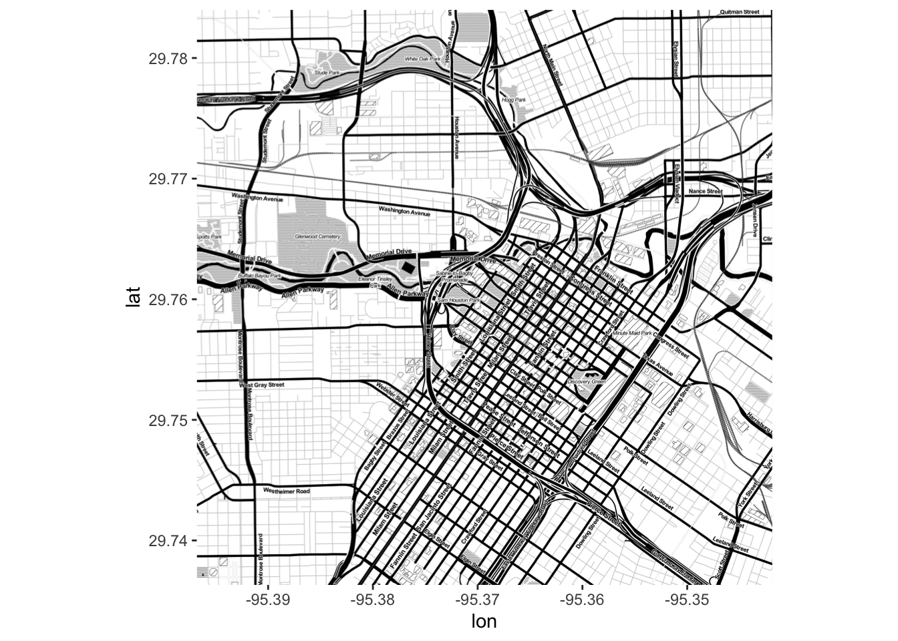
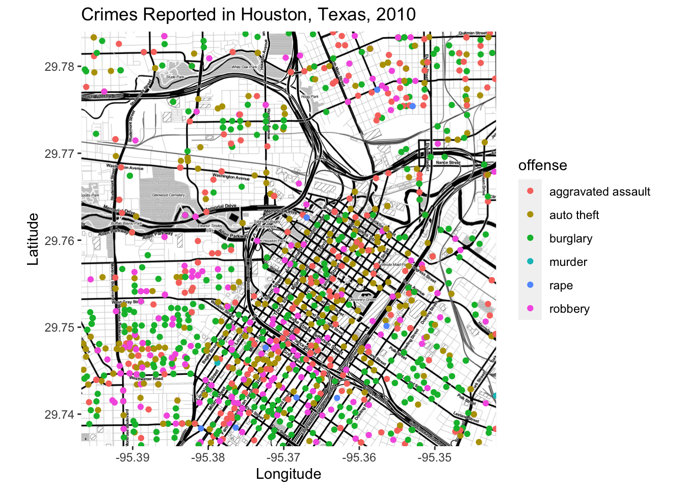

# Static maps using ggmap

*Written by Annie Collins and last updated on 7 October 2021.*

## Introduction

> `ggmap` is an R package that makes it easy to retrieve raster map tiles from popular online mapping services like Google Maps and Stamen Maps and plot them using the ggplot2 framework

Now that you're familiar with `ggplot2` and its plotting capabilities, we can start looking at some more advanced data visualization options. Next up: maps.

In this lesson, you will learn how to:  

- Use `ggmap` to plot geospatial data over maps; and
- Access Google Maps APIs to extend `ggmap`'s functions to Google Maps as well.

Prerequisite skills include:

- Familiarity with `ggplot2` and its plotting functions, specifically `geom_point()` and `stat_density2d()`.

## Package

Unless you have worked with `ggmap` before, you will likely have to install the package from GitHub (it is also available from CRAN, but GitHub contains the most up-to-date version which is important in this case given that the package works with external APIs).


```r

devtools::install_github("dkahle/ggmap")
library(ggmap)

```

## Backgrounds

Much like the way you build a plot in `ggplot2`, `ggmap` plots are constructed by adding to your plot feature by feature, starting with a map background. `ggmap` allows you to use map backgrounds from two different sources: Google Maps and Stamen. Both offer several options for aesthetics and customization and are fairly similar in their use. Google Maps requires access to Google APIs (see *Google Maps API* below) while Stamen Maps authentication is built into the package, so we will focus on Stamen backgrounds for the purpose of this lesson.

For a Stamen Map background, we use the function `get_stamenmap()`. This function takes several arguments that allow you to customize the appearance and format of your map, but most importantly you must state the boundaries, scale, and type of your map. The object produced by `get_stamenmap()` then gets passed to the `ggmap()` function which allows you to view the map in the "Plots" tab as well as display data on top of it.

| Argument | Parameter | Details |
| -------- | --------- | ---------------------|
| bbox | vector | A vector stating the locations of the corners of your desired map in the format c(lower left longitude, lower left latitude, upper right longitude, upper right latitude) |
| zoom | numeric | Level of zoom into focus area |
| maptype | string | Aesthetic of map produced. Options are: "terrain", "terrain-background", "terrain-labels", "terrain-lines", "toner", "toner-2010", "toner-2011", "toner-background", "toner-hybrid", "toner-labels", "toner-lines", "toner-lite", and "watercolor". |

See `?get_stamenmap` for additional arguments and details.


```r
# Houston, Texas
# Also try the additional maptypes listed above
map <- get_stamenmap(c(-95.39681, 29.73631, -95.34188, 29.78400), zoom = 15, maptype = "toner")

ggmap(map)
```



**Tip**: If you don't know the exact coordinates of the map you wish to use as a background, clicking anywhere on [Google Maps](https://www.google.com/) will give you the longitude and latitude of the selected location.

One thing that is important to know is that when loading map backgrounds we are working with longitude and latitude coordinates in **decimal degree** format. It is important to take note of the relative values of coordinates when defining map boundaries, and these will change depending on which hemisphere you're in. In North America (the northern and western hemispheres), the lower left hand corner of the map will always be the smaller longitude value (farthest west) and the smaller latitude value (farthest south). The image below might help you to visualize the relationship between coordinate values.

<div class="figure">

<p class="caption">(\#fig:unnamed-chunk-2)Source: Esri</p>
</div>

## Plotting Data

Now we can start to visualize some data on top using our familiar `ggplot2` functions. We will be using the data set `crime` that is built into the `ggmap` package. Any data used with `ggmap` must have variables for longitude and latitude coordinates in decimal degree format for each observation, as these serve as the x and y coordinates when graphing on top of a map background.

A useful way to visualize data in this context is a scatterplot using `geom_point()`.


```r
# Filter out data points that fall outside of our mapped area, and thefts (which we will look at separately later)
local_crime <- ggmap::crime %>% filter(-95.39681 <= lon & lon <= -95.34188, 29.73631 <= lat & lat <=  29.78400, offense != "theft")

map <- get_stamenmap(c(-95.39681, 29.73631, -95.34188, 29.78400), zoom = 15, maptype = "toner")

ggmap(map) + geom_point(data = local_crime, aes(x=lon, y=lat, colour = offense)) + 
  ggtitle("Crimes Reported in Houston, Texas, 2010") +
  xlab("Longitude") +
  ylab("Latitude")
```



For crimes that appear very frequently in the data set, it might be more useful to use a heat map to track density instead of individual reports. We can see what this looks like using the thefts from the `crime` data set.


```r
# Filter out data points that fall outside of our mapped area, and all offenses except theft
local_theft <- crime %>% filter(-95.39681 <= lon & lon <= -95.34188, 29.73631 <= lat & lat <=  29.78400, offense == "theft")

ggmap(map) + stat_density2d(data = local_theft, aes(x=lon, y=lat, fill = ..level.., alpha = 0.5), geom = "polygon") + 
  scale_fill_gradient2(name = "Thefts") +
  ggtitle("Density of Thefts Reported in Houston, Texas, 2010") +
  xlab("Longitude") +
  ylab("Latitude")
```


Like `ggplot2`, `ggmap` also works with `facet_wrap()`. Suppose we want to compare aggravated assaults and auto theft in Houston.


```r
assault_auto <- crime %>% filter(-95.39681 <= lon & lon <= -95.34188, 29.73631 <= lat & lat <=  29.78400, offense == "aggravated assault" | offense == "auto theft")

ggmap(map) + stat_density2d(data = assault_auto, aes(x=lon, y=lat, fill = ..level.., alpha = 0.4), geom = "polygon") + 
  scale_fill_gradient2(name = "Reports") +
  ggtitle("Density of Crimes Reported in Houston, Texas, 2010") +
  xlab("Longitude") +
  ylab("Latitude") +
  facet_wrap(~ offense)
```


## Exercises

To get you comfortable working with `ggmap`'s syntax and plotting capabilities, you're now going to build a map of COVID-19 testing locations in Toronto from the data set `covid_testing_locations` which has columns *long* and *lat*.


```r
head(covid_testing_locations)
#> # A tibble: 6 × 6
#>   `_id` locationName      locationType  address   long   lat
#>   <dbl> <chr>             <chr>         <chr>    <dbl> <dbl>
#> 1 36320 Etobicoke Genera… Assessment C… 101 Hum… -79.6  43.7
#> 2 36321 Humber River Hos… Assessment C… 200 Chu… -79.5  43.7
#> 3 36322 Humber River Hos… Assessment C… 2111 Fi… -79.5  43.8
#> 4 36323 Michael Garron H… Assessment C… 825 Cox… -79.3  43.7
#> 5 36324 Mount Sinai Hosp… Assessment C… 600 Uni… -79.4  43.7
#> 6 36325 Auduzhe Mino Nes… Assessment C… 22 Vaug… -79.4  43.7
```

### Exercise 1

Your first task is to load the background of the map. The key to doing so correctly is to establish the correct boundaries for the map in terms of longitude and latitude coordinates, then load a map from Stamen Maps and save it under the name `toronto_map`. Complete the code below to create a background map of Toronto that will appropriately display the data (use zoom 10 and maptype "terrain").

<!-- ```{r ggmap-exercise-1, exercise=TRUE, message=FALSE} -->
<!-- toronto_map <- get_stamenmap(c(-75, 41, -74, 42), zoom=10, maptype="terrain") -->

<!-- ggmap(toronto_map) -->
<!-- ``` -->

<!-- ```{r ggmap-exercise-1-hint-1} -->
<!-- # Use the max() and min() functions to determine the farthest north, south, east, and west of the coordinates in the data -->
<!-- max(covid_testing_locations$long) # Farthest east -->
<!-- min(covid_testing_locations$long) # Farthest west -->
<!-- max(covid_testing_locations$lat)  # Farthest north -->
<!-- min(covid_testing_locations$lat)  # Farthest south -->
<!-- ``` -->

<!-- ```{r ggmap-exercise-1-hint-2} -->
<!-- # Solution -->
<!-- toronto_map <- get_stamenmap(c(-79.82364, 43.52281, -78.85145, 44.09669), zoom=10, maptype="terrain") -->
<!-- ``` -->


### Exercise 2

Using `toronto_map` as defined above and your knowledge of `ggplot2`, complete the code below to construct a map that shows each COVID-19 testing location as a dot, with the dots coloured according to the type of assessment center they are.

<!-- ```{r ggmap-exercise-2, exercise=TRUE, message=FALSE, warning=FALSE} -->
<!-- ggmap(toronto_map) + geom_point(data=covid_testing_locations, aes(x=lat, y=long)) -->
<!-- ``` -->

<!-- ```{r ggmap-exercise-2-hint-2} -->
<!-- # Solution -->
<!-- ggmap(toronto_map) + geom_point(data=covid_testing_locations, aes(x=long, y=lat, color=locationType)) -->
<!-- ``` -->

### Exercise 3

Finally, display several maps comparing the *density* of different types of testing locations. Title your plot "COVID-19 Testing Centers in Toronto, Ontario".

<!-- ```{r ggmap-exercise-3, exercise=TRUE, message=FALSE, warning=FALSE} -->
<!-- ggmap(toronto_map) + -->
<!--   stat_density2d(data=covid_testing_locations,  -->
<!--                  aes(x=long,  -->
<!--                      y=lat,  -->
<!--                      fill=..level..,  -->
<!--                      alpha=0.5 -->
<!--                      ),  -->
<!--                  geom="polygon") -->
<!-- ``` -->

<!-- ```{r ggmap-exercise-3-solution} -->
<!-- # Solution -->
<!-- ggmap(toronto_map) + -->
<!--   stat_density2d(data=covid_testing_locations,  -->
<!--                  aes(x=long,  -->
<!--                      y=lat,  -->
<!--                      fill=..level..,  -->
<!--                      alpha=0.5 -->
<!--                      ),  -->
<!--                  geom="polygon") +  -->
<!--   facet_wrap(~locationType) + -->
<!--   ggtitle("COVID-19 Testing Centers in Toronto, Ontario") -->
<!-- ``` -->


## Google Maps APIs

In addition to Stamen Maps, `ggmap` can draw on Google Maps APIs for its Google Maps backgrounds, and in order to do this you must first register with Google. This involves creating an account if you do not already have a Google account, as well as registering a valid credit card (it will not be charged unless you select an account upgrade that requires payment).

To begin, go to the Google Maps Platform [website](https://cloud.google.com/maps-platform/). Follow the instructions to register an account and a payment method (credit card), and you will receive an **API key**. This is important! You need to register this within R and RStudio using the following code:


```{r-enter-API-code}
register_google(key = "[your key]", write = TRUE)    # Copy and paste your API key in quotations
```

You also want to make sure that you don't share this key with anyone since it is private and personal to each user, so keep this in mind if you're sharing your code anywhere.

Once you've gained access to the Google Maps Platform you will need to enable the relevant APIs: Geocoding and Maps Static. These are the APIs that work with the functions in `ggmap`, specifically `get_googlemap()` (analogous to `get_stamenmap()`), `geocode()`, and `revgeocode()`. These functions cannot be demonstrated within this module until you have access to the appropriate APIs, but the [ggmap repository README](https://github.com/dkahle/ggmap) contains some examples and resources for using Google Maps with `ggmap`.


## Next Steps

- Once you have the Google Maps APIs working on your system, repeat the above exercises using `get_googlemap()` in place of `get_stamenmap()`;
- Use `ggimage` to create more complex icon maps (check out this [tutorial](https://www.littlemissdata.com/blog/iconmap) from R user and data scientist Laura Ellis);
- Check out the `usmaps` package for more mapping functions specific to the United States.


## Exercises

### Question 1

### Question 2

### Question 3

### Question 4

### Question 5

### Question 6

### Question 7

### Question 8

### Question 9

### Question 10


