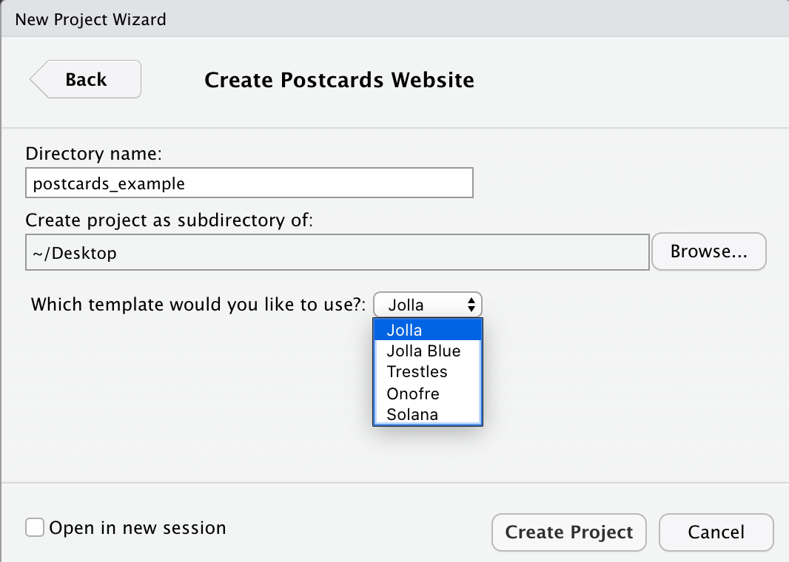
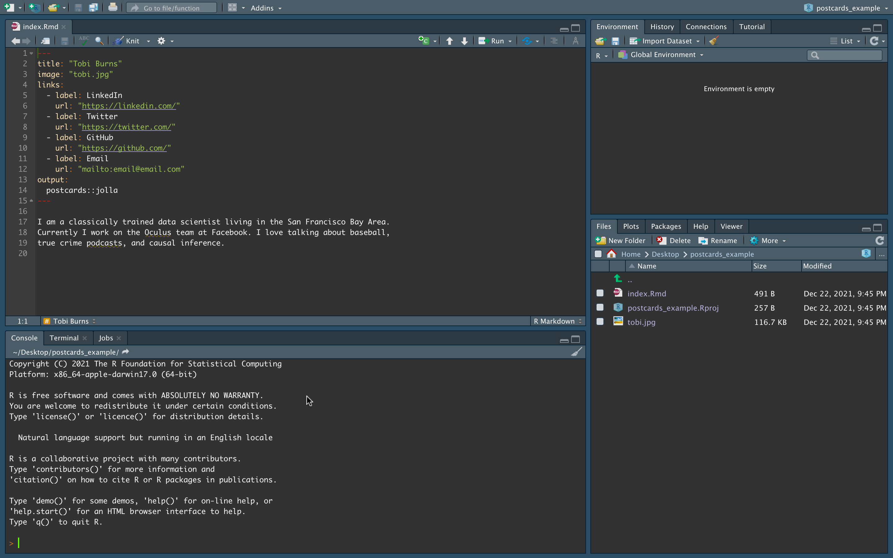
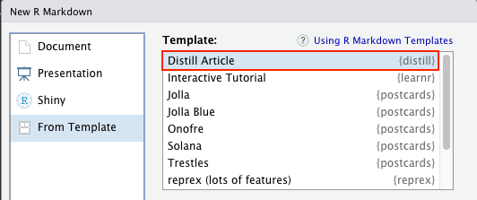
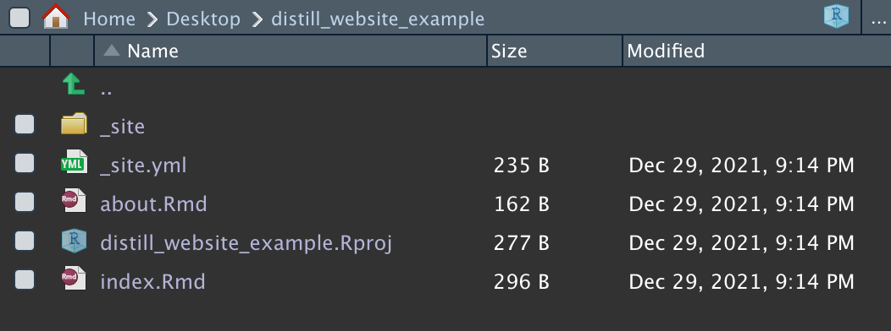

# Distill and postcards

*Written by Annie Collins and last updated on 27 January 2022.*

## Introduction
If you have made it this far into the DoSS Toolkit, you have likely encountered R Markdown at some point in your R journey. You may also have come across Blogdown, the R package used for building simple blogs using R Markdown. R Markdown documents and Blogdown websites are rather flexible and straightforward to implement, however they may not support all the features necessary for your desired publications. In this module we will look at two formats that are specifically optimized for personal, academic, scientific, and technical communication: Distill and Postcards. These formats draw upon the existing R Markdown structure so you can use familiar tools to produce more tailored content, from individual articles to full websites and blogs.

By the end of this chapter, you should be able to:

- Set up basic websites using Distill or Postcards

Pre-requisite knowledge includes:

- Experience with GitHub
- Knowledge of R Markdown
- Knowledge of Blogdown (see Chapter 104: Getting started with Blogdown)

## Postcards
We will begin with Postcards, which is the simpler option in terms of website set up and deployment. Postcards websites can generally be used as personal or academic landing pages to showcase a brief summary of your personal, professional, or academic background as well as links to other relevant sites like GitHub, LinkedIn, or Twitter. These sites are not extensive; like the name would suggest, Postcard sites are a single page with an image and a small amount of text. While this may seem overly simple, key strength of this package is its ability to produce and deploy a well-formatted, self-contained website quickly and with very little knowledge beyond standard R Markdown functionality.

Before beginning, you will likely need to install the Postcards package. You can do so in the same way as other packages from CRAN, by using the code below.

```r
install.packages("postcards")
library(postcards)
```

There are two ways to create a new postcard: using the command line and the function `create_postcard()` from an empty directory, or by creating a new directory containing a Postcards website. We will begin with looking at the latter.

To create a new directory, go to **File > New Project > New Directory > Postcards Website**. When creating a Postcards site, you will need to specify a directory name and Postcards template. There are five templates to choose from: Jolla, Jolla Blue, Trestles, Onofre, and Solana. The default appearance and header for each template can be found on the [Postcards GitHub repo](https://github.com/seankross/postcards#the-templates). For the most part, these templates are meant to be used as-is with little customization beyond the content presented on the website.



The exact same outcome as above can be accomplished using the command line and an empty directory. Begin by creating a new R Project in a new or existing directory (if the directory already exists, be sure that is is empty). For this method, you could also create an empty Git repository first and start your R Project with version control. Depending on your usual workflow, this may be a benefit of working in the command line.

The main function in the Postcards package is `create_postcard()`. The function has a default for every argument so it can be executed as-is, which will create a site using the Jolla template. Templates can be changed using the `template` argument. For this workflow there is no need to change any of the arguments, however these are described in detail in the function documentation (`?create_postcard`).


```r
create_postcard(
  file = "index.Rmd",
  template = "jolla",
  create_dir = FALSE,
  edit = TRUE,
  create_image = TRUE
)
```


```r
postcards::create_postcard(template = "jolla")
postcards::create_postcard(template = "jolla-blue")
postcards::create_postcard(template = "trestles")
postcards::create_postcard(template = "onofre")
postcards::create_postcard(template = "solana")
```

Once the Postcard has been created, you'll have a directory that contains your R Project file, an Rmd file called **index.Rmd**, and a .jpg file which serves as the default headshot for whichever template you have selected. In the image below, I have used the Jolla template as indicated in the Rmd header.



At this stage you can begin customizing your Postcard site. This should involve:

- Replacing the default .jpg with your own headshot or custom image, and changing the `image:` file path under the .Rmd YAML header accordingly
- Updating the links in the .Rmd YAML header to direct to your own content
- Personalizing the text in the body of the file. Depending on the template you use, this may be best formatted as a basic introduction, a minimal CV, or a combination of both.

As with any R Markdown document, you can always Knit your file to deploy it locally and test its functionality and appearance as you make changes.

## Distill
Distill allows you to produce both individual articles and full websites using the R Markdown framework, plus additional features that aid in technical communication. Some of these features include:

- Tables of contents
- Interactive tables
- More flexible figure formatting
- Equations
- Hoverable footnotes
- Asides
- Code folding
- Syntax highlighting
- Appendices

Before we begin, it may be useful to examine some existing Distill content to see if this format will work for your purposes. Here are some examples of websites:

- The [Distill for R Markdown website](https://rstudio.github.io/distill/), created by JJ Alaire, Rich Iannone, Alison Hill, and Yihui Xie
- [Tidymodels, Virtually](https://tmv.netlify.app/site/), created by Alison Hill
- [Open Source Football](https://www.opensourcefootball.com/), created by Sebastian Carl
- DoSS Professor Rohan Alexander's [website](https://rohanalexander.com/)

### Distill Articles

To get started with Distill, you will likely need to install the Distill R package. You can do so in the same way as other packages from CRAN, by using the code below.

```r
install.packages("distill")
library(distill)
```

We will start by creating a single article. Distill articles are created the same way that R Markdown files are created, with the addition of specifying "Distill Article" as the template.



You'll notice a few differences between the contents of a Distill article compared to a normal R Markdown document. Distill article headers automatically come with more advanced formatting options for authors, including affiliations and URLs for relevant websites. You can also add an author's ORCID iD (with argument `orcid_id`) in this header. Distill will automatically adjust for different combinations of inputted author information as well as multiple authors where necessary. Another change from the default R Markdown header is the output type, which is now `output: distill::distill_article`.


```r
---
title: "Untitled"
description: |
  A new article created using the Distill format.
author:
  - name: Nora Jones 
    url: https://example.com/norajones
    affiliation: Spacely Sprockets
    affiliation_url: https://example.com/spacelysprokets
date: "`r Sys.Date()`"
output: distill::distill_article
---
```

From here you can begin authoring an article much in the same was as your typical R Markdown document. A list of potential article features is available on the [Distill website](https://rstudio.github.io/distill/basics.html#figures).


### Distill Websites

Distill websites serve as collections of Distill articles with additional features to support a custom appearance and navigation. Creating a new Distill website is easily done in RStudio through creating a new R project and selecting the **Distill Website** project type (you will also see a **Distill Blog** option under Project Type; Distill blogs are slightly different and will be discussed later).

A new Distill website has three files (in addition to the R project file) and a directory by default.



The .Rmd files contain content that will be displayed on your website: **index.Rmd** contains the homepage content and **about.Rmd** contains content stored under the website's "About" page. **\_site.yml** indicates many of the high-level structure and appearance characteristics of your site. You can get a first look at your default website by entering the **Build** tab (upper right window in RStudio) and clicking **Build Website**. This will deploy a local HTML copy of your site, similar to knitting an R Markdown document.

#### Structure

The main website directory contains any and all .Rmd files that are displayed as pages on the website. This is where **index.Rmd** and **about.Rmd** should remain, and where new .Rmd files should be created and stored. When the website is built, any .Rmd files in the main directory will be knit to HTML and copied to the `_site` directory (regardless of whether or not they are actually included in the site).

A second key file is **\_site.yml**, automatically generated upon creation of your site and stored in the main directory. This file controls the title of the site, contents of the navigation bar, and several other high level features of a Distill website. There are several components of the site automatically indicated in the **\_site.yml** file upon creation of a Distill site. 


```r
name: "distill_website_example"
title: "My Website"
theme: theme.css
description: |
  My Website
output_dir: "_site"
navbar:
  right:
    - text: "Home"
      href: index.html
    - text: "About"
      href: about.html
output: distill::distill_article
```

Some additional options that may be worth adding include:

- Additional navigation bar options (nested under `navbar`)
    - `search: true` adds a search bar for your site
    - `logo:` with `image:` (file path) and `href:` (source URL) nested underneath adds a logo to the header
    - `source_url:` adds a link the website’s GitHub repository
    - If you want text in the navigation bar to create a drop down menu instead of linking directly to a page, you can use the `menu` option as follows:

```r
navbar:
  right:
    - text: "Dropdown"
      menu: 
        - text: "Dropdown item 1"
          href: dropdown-item-1.html
        - text: "Dropdown item 2"
          href: dropdown-item-2.html
```
    
- Themes
    - Themes will be covered in briefly in the next section, but they can be applied at the site level by inputting `theme: theme.css` (adjusted for the name of your own .css file)
- Analytics
    - `google_analytics:` followed by a Google Analytics code will allow Google Analytics to track activity across all pages of your distill site
- Output directory contents
    - `include: ["FILE NAME"]` and `exclude: ["FILE NAME"]` can be used to override default behaviours for files getting copied to the output folder once knit. In addition to the default knitting behaviour described previously, files beginning with “.” and “_” as well as R source code files, R data files, and configuration information are not copied to the `_site` directory upon knitting

<!-- Add more here? -->

### Distill Blogs

Distill blogs are similar to Distill websites in that they offer a format for displaying multiple Distill articles in a cohesive web-based format. Blogs, however, also contain collections of blog posts that are organized and displayed in a cohesive manner. Blogs also differ in that blog posts are not automatically re-rendered each time the site is built (they have to be manually re-rendered when updated). This prevents errors from appearing over time as package contents and dependencies change.

Distill blogs can be created in the same way as Distill websites, either using the New Project dialogue windows or via `create_blog()` in the console. Once created, the main difference you may notice about the initial configuration of your blog is the presence of a `_posts` directory in addition to the `_site` directory. `_posts` contains sub-directories that house all files related to a given blog post.


To create a blog post, use the `create_post()` function. 


```r
create_post(
  title,
  collection = "posts",
  author = "auto",
  slug = "auto",
  date = Sys.Date(),
  date_prefix = date,
  draft = FALSE,
  edit = interactive()
)
```

The main argument for `create_post()` is `title` where you can indicate the title of your post. `collection` indicates the folder where the post will be initialized, defaulting to the original `_posts` directory. Executing `create_posts()` creates a new sub-directory within the directory indicated by the `collection` argument that contains a Distill article (.Rmd file) and file folder where your blog content can be created. In the following section, we will look at an example of a new post being created outside of the `_posts` directory.

#### Collections and Listing Pages

A key feature of Distill blogs is **listing pages**. Listing pages are pages on your blog that display collections of available blog posts. There are a few steps involved in creating a listing page: 

1. Create an .Rmd file in the main blog directory and configure it within your website using the **\_site.yml** file. In the example below I’ve created a file called **more_posts.Rmd** and linked its corresponding HTML file in the site header under the name “More Posts”.


```r
name: "distill_blog_example"
title: "My Blog"
description: |
  My Blog
output_dir: "_site"
navbar:
  right:
    - text: "Home"
      href: index.html
    - text: "About"
      href: about.html
    - text: "More Posts"
      href: more_posts.html
output: distill::distill_article
```


<!-- ```{r, echo=FALSE, out.width="50%", fig.align = "center"} -->
<!-- knitr::include_graphics(here::here("images", "106_distill_4.png")) -->
<!-- ``` -->

2. Create a new sub-directory in the main blog directory containing the posts you wish to display in this listing. You can either move files into this directory from another existing directory (just by moving the post directory, for example the default **welcome** directory nested under **\_posts**) or create new blog posts using the `create_post()` function. In this example, I have added a directory called `more_posts`, and executed `create_posts("A second post", collection = "more_posts")` to create a new post within this directory. Executing `create_post()` creates a sub-directory within the listing directory containing a Distill article and file folder where your blog content can be created. The post directory is initialized with the naming convention "CURRENT DATE-INPUTTED TITLE". This convention keeps posts displayed automatically from newest to oldest. Knit this post before building the website, otherwise the HTML file will not exist and not be displayed.


3. Next, return to the .Rmd file you created to host your listing. In the YAML header, choose a title for your listing and add `listing: more_posts` (customized to match the name of the listing directory you created in step 2). Knit this file before building the rest of the website, otherwise the HTML file will not be produced in the `_site` directory.


```r
---
title: "More Posts"
site: distill::distill_website
listing: more_posts
---
```

<!-- # ```{r, echo=FALSE, out.width="50%", fig.align = "center"} -->
<!-- # knitr::include_graphics(here::here("images", "106_distill_6.png")) -->
<!-- # ``` -->

4. Now you can build your website, click through to your new listing, and see your new blog post displayed.


Posts will automatically be listed in order of date created. You can override this by organizing by [category](https://rstudio.github.io/distill/blog.html#categories) or in a [custom order](https://rstudio.github.io/distill/blog.html#categories).

### Themeing

A custom theme can be created in a .css file for implementation either at the site level or within individual articles. CSS stands for “Cascading Style Sheet”. CSS files control aspects of web design like font, text size, and colour scheme. The function `create_theme()` has been designated for this purpose, and will generate a .css file in the main directory outlining the default settings. This file can then be customized and implemented on your Distill site, either at the site level (via the **\_site.yml** file) or at the article level (via the YAML header in each article's .Rmd file). [Details](https://rstudio.github.io/distill/website.html?panelset2=inspiration2#theming) and [examples](https://rstudio.github.io/distill/website.html?panelset2=inspiration2#example-themes) of themes are available on the Distill website.

## Deploying Your Site

Once you're ready to make your Postcard or Distill website public, it can be easily deployed using [GitHub Pages](https://pages.github.com/) or [Netlify](https://www.netlify.com/). Instructions for deploying with Netlify can be found in Section 104.5: Making your Website Public.

## Next Steps
If you wish to combine the appearance of Postcard with the functionality of a Distill website, you can create a Postcard within a Distill website or blog (or move the .Rmd file containing a Postcard to the relevant directory if it is already created) and add it to the site via the **\_site.yml** file.

There are plenty of additional features and customization that can be added to Distill articles, blogs, and websites. A comprehensive list can be found on the [Distill for R Markdown](https://rstudio.github.io/distill/) website and in this [R Studio blogpost](https://www.rstudio.com/blog/distill/) by Distill authors Alison Hill and JJ Allaire. 

## Exercises

### Question 1

What is the default Postcard theme?

  a.  Jolla
  b. Jolla blue
  c. Trestles
  d. Onofre
  
### Question 2

Which of the following are functions in the `distill` package?

  a. `create_article()`
  b. `create_blog()`
  c. `create_post()`
  d.  All of the above

### Question 3

Which of the following are functions in the `postcards` package?

  a.  `create_postcard()`
  b. `create_website()`
  c. `create_article()`
  d. All of the above

### Question 4

Which of the following statements is true?

  a. `postcards` can be used to build a website that serves as a collection of postcards pages
  b. The appearance of a Distill website is generally meant to be used as-is with little customization to colour schemes, layouts, fonts, etc.
  c.  Distill websites and blogs are curated, organized collections of Distill articles
  d. Postcards and Distill articles cannot be combined into one website

### Question 5

Which of the following actions will produce the same result as executing `create_website()`?

  a.  Selecting **New Project > New Directory > Distill Website > Create Project**
  b. Going to GitHub Pages or Netlify, creating a site, and importing this site into a new R Project
  c. Executing `create_postcard()`
  d. Selecting **New Project > New Directory > Distill Blog > Create Project**

### Question 6

What will be the result of the following code in a Distill website's **\_site.yml** files:

```r
navbar:
  right:
    - text: "Home"
      href: home.html
    - text: "About"
      menu: 
        - text: "Resume"
          href: resume.html
```

  a. A website called "Home" with a navigation bar containing the options "About" and "Resume"
  b. A website with navigation bar options "Home", "About", and "Resume" linking to unique pages
  c. A website with navigation bar options "Home", "About", and "Resume" where "Resume" leads to a drop down menu
  d.  A website with navigation bar options "Home" and "About" where "About" leads to a drop down menu
  
### Question 7

What name refers to the name of a page on a Distill blog that displays a list of available blog posts?

  a. Categories
  b. Article
  c.  Listing
  d. Index

### Question 8

Every page on a Distill blog is either a listing or a blog post.

  a. True
  b.  False

### Question 9

The directory containing a Distill blog must contain at least two sub-directories.

  a.  True
  b. False

### Question 10

Consider the following work flow: I create a Distill blog using `create_blog()`. I create a new post by executing `create_post("New Post")`. Then I click "Build Website". What will the resulting website look like?

  b. An error will occur and the website will not build
  c.  The default Distill blog with an empty listing on the main page  
  a. The default Distill blog with a listing on the main page linking to the blog post "New Post"
  d. The default Distill blog with a "New Post" appearing in the navigation bar linking to the new blog post

