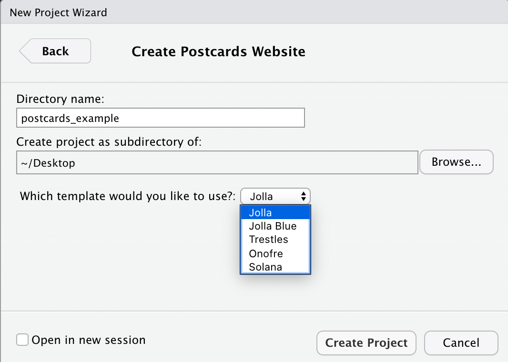
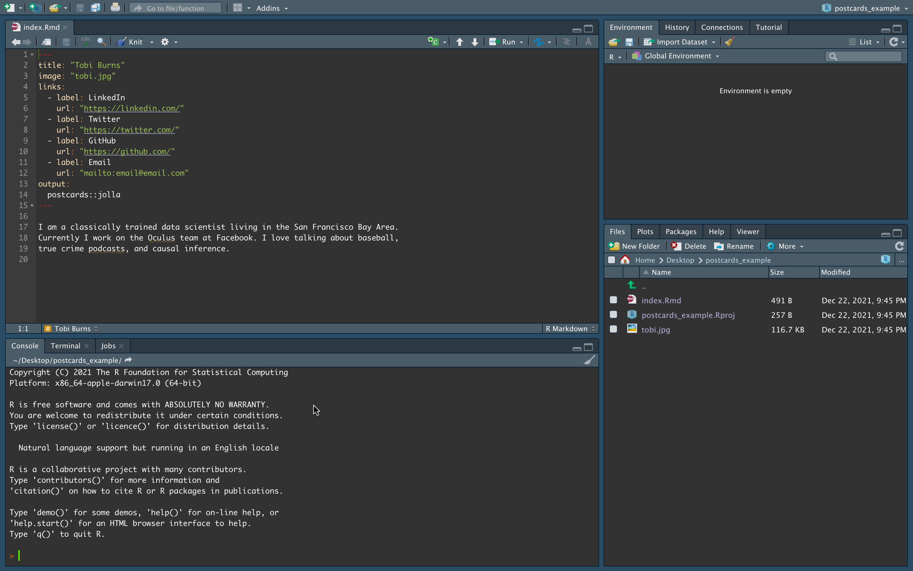

# Distill and postcards

*Written by Annie Collins and last updated on 18 December 2021.*

## Introduction
If you have made it this far into the DoSS Toolkit, you have likely encountered R Markdown at some point in your R journey. You may also have come across Blogdown, the R package used for building simple blogs using R Markdown. R Markdown documents and Blogdown websites are rather flexible and straightforward to implement, however they may not support all the features necessary for your desired publications. In this module we will look at two formats that are specifically optimized for scientific, technical, academic and personal communication: Distill and postcards. These formats add to the existing R Markdown structure so you can use familiar tools to produce more tailored content, from individual articles to full websites and blogs.

By the end of this chapter, you should be able to:

- Set up a basic website using Distill and postcards
- Identify differences between Blogdown, Distill, and postcards, and use cases for each format

Pre-requisite knowledge includes:

- Experience with GitHub
- Knowledge of R Markdown
- Knowledge of Blogdown (see Chapter 104: Getting started with Blogdown)

## Postcards
We will begin with postcards, which is the simpler option in terms of website set up and deployment. Postcards websites can generally be used as personal or academic landing pages to showcase a brief summary of your personal, professional, or academic background as well as links to other relevant sites like GitHub, LinkedIn, or Twitter. These sites are not extensive; like the name would suggest, Postcard sites are a single page with an image and a small amount of text. While this may seem overly simple, key strength of this package is its ability to produce and deploy a well-formatted, self-contained website quickly and with very little knowledge beyond standard R Markdown functionality.

Before beginning, you will likely need to install the Postcards package. You can do so in the same way as other packages from CRAN, by using the code below.

```r
install.packages("postcards")
library(postcards)
```

There are two ways to create a new postcard: using the command line and the function `create_postcard()` from an empty directory, or by creating a new directory containing a Postcards website. We will begin with looking at the latter.

To create a new directory, go to **File > New Project > New Directory > Postcards Website**. When creating a Postcards site, you will need to specify a directory name and Postcards template. There are five templates to choose from: Jolla, Jolla Blue, Trestles, Onofre, and Solana. The default appearance and header for each template can be found on the [Postcards GitHub repo](https://github.com/seankross/postcards#the-templates). For the most part, these templates are meant to be used as-is with little customization beyond the content presented on the website.



The exact same outcome as above can be accomplished using the command line and an empty directory. Begin by creating a new R Project in a new or existing directory (if the directory already exists, be sure that is is empty). For this method, you could also create an empty Git repository first and start your R Project with version control. Depending on your usual workflow, this may be a benefit of working in the command line.

The main function in the Postcards package is `create_postcard()`. The function has a default for every argument so it can be executed as-is, which will create a site using the Jolla template. Templates can be changed using the `template` argument. For this workflow there is no need to change any of the arguments, however these are described in detail in the function documentation (`?create_postcard`).


```r
create_postcard(
  file = "index.Rmd",
  template = "jolla",
  create_dir = FALSE,
  edit = TRUE,
  create_image = TRUE
)
```


```r
postcards::create_postcard(template = "jolla")
postcards::create_postcard(template = "jolla-blue")
postcards::create_postcard(template = "trestles")
postcards::create_postcard(template = "onofre")
postcards::create_postcard(template = "solana")
```

Once the Postcard has been created, you'll have a directory that contains your R Project file, an Rmd file called "index.Rmd", and a jpg file which serves as the default headshot for whichever template you have selected. In the image below, I have used the Jolla template as indicated in the Rmd header.



At this stage you can begin customizing your Postcard site. This should involve:

- Replacing the default .jpg with your own headshot or custom image, and changing the `image:` file path under the Rmd header accordingly
- Updating the links in the Rmd header to direct to your own content
- Personalizing the test in the body of the file. Depending on the template you use, this may be best formatted as a basic introduction, a minimal CV, or a combination of both.

As with an R Markdown document, you can always Knit your file to deploy it locally and test its functionality and appearance as you make changes. Once you're ready to make your Postcard public, it can be easily deployed using [GitHub Pages](https://pages.github.com/) or [Netlify](https://www.netlify.com/). Instructions for deploying with Netlify can be found in Section 104.5: Making your Website Public.

## Distill
Distill allows you to produce both individual articles and full websites using the R Markdown framework plus additional features that aid in technical communication. Some of these features include:

- Tables of contents
- Interactive tables
- More flexible figure formatting
- Equations
- Hoverable footnotes
- Asides
- Code folding
- Syntax highlighting
- Appendices

Before we begin, it may be useful to examine some existing Distill content to see if this format will work for your purposes. Here are some examples of websites:
- The [Distill for R Markdown website](https://rstudio.github.io/distill/), created by JJ Alaire, Rich Iannone, Alison Hill, and Yihui Xie
- [Tidymodels, Virtually](https://tmv.netlify.app/site/), created by Alison Hill
- [Open Source Football](https://www.opensourcefootball.com/), created by Sebastian Carl

To get started with Distill, you will likely need to install the Distill R package. You can do so in the same way as other packages from CRAN, by using the code below.

```r
install.packages("distill")
library(distill)
```

We will start by creating a single article. Distill articles are created the same way that R Markdown files are created, with the addition of specifying "Distill Article" as the template.


You'll notice a few differences between the contents of a Distill article compared to a normal R Markdown document. Distill article headers automatically come with more advanced formatting options for authors, including affiliations and URLs for personal and affiliated websites. You can also add an author's ORCID iD (with argument `orcid_id`) in this header. Distill will automatically adjust for different combinations of inputted information as well as multiple authors where necessary. Another change from the default R Markdown header is the output type, which is now `output: distill::distill_article`.


```r
---
title: "Untitled"
description: |
  A new article created using the Distill format.
author:
  - name: Nora Jones 
    url: https://example.com/norajones
    affiliation: Spacely Sprockets
    affiliation_url: https://example.com/spacelysprokets
date: "`r Sys.Date()`"
output: distill::distill_article
---

# ```{r setup, include=FALSE}
# knitr::opts_chunk$set(echo = FALSE)
# 
# ```

Distill is a publication format for scientific and technical writing, native to the web. 

Learn more about using Distill for R Markdown at <https://rstudio.github.io/distill>.
```


## Exercises

### Question 1

### Question 2

### Question 3

### Question 4

### Question 5

### Question 6

### Question 7

### Question 8

### Question 9

### Question 10
