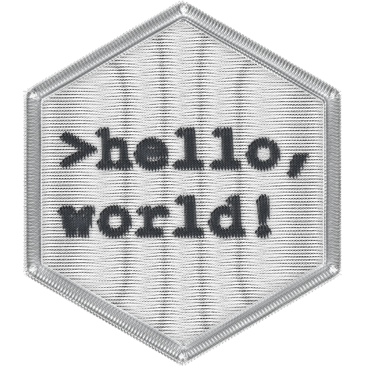
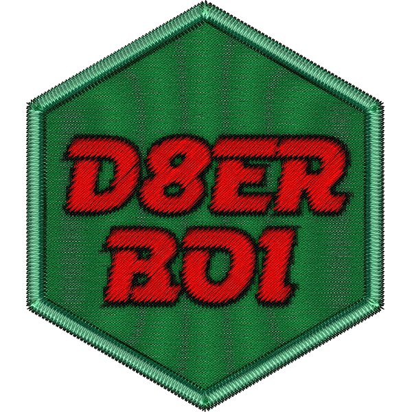
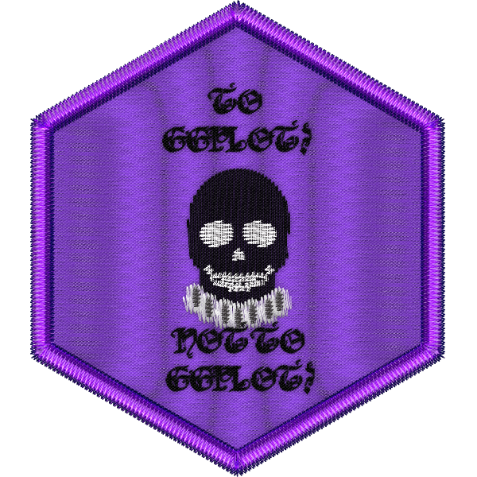
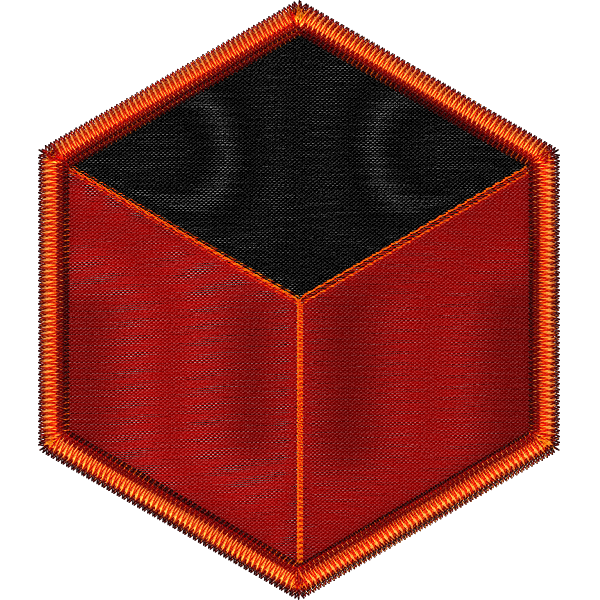
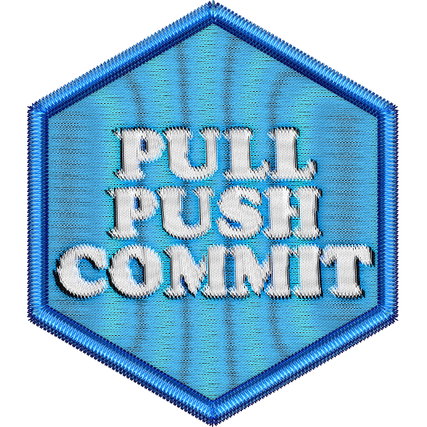
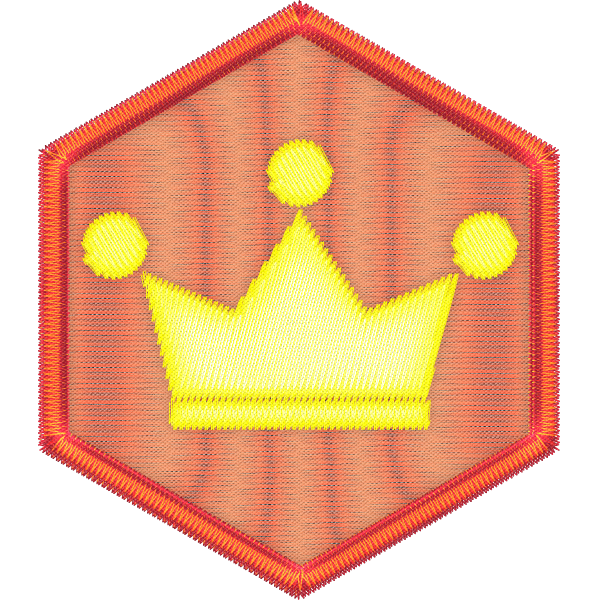
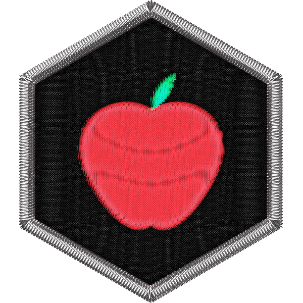

--- 
title: "DoSS Toolkit"
author: "Ananya, Annie, Haoluan, Isaac, José, Leuven, Mariam, Marija, Matthew, Michael, Rohan, Ruijia, Sam, Shirley, Simone, Uzair, Yena, and Yiqu"
date: "2021-10-07"
site: bookdown::bookdown_site
documentclass: book
bibliography: [book.bib, packages.bib]
# url: your book url like https://bookdown.org/yihui/bookdown
# cover-image: path to the social sharing image like images/cover.jpg
description: |
  A collection of self-paced materials to help you learn and use R.
biblio-style: apalike
csl: chicago-fullnote-bibliography.csl
---

# Preface

*by Rohan Alexander*

## DoSStoolkit 

The DoSS Toolkit is a collection of self-paced materials to help you learn and use R.

We all know that R is a critical part of applied statistics and data science these days, but it can have a steep learning curve and be intimidating to get started with. 

The [Department of Statistical Sciences](http://www.utstat.utoronto.ca/) (DoSS) toolkit is a free series of open source online modules by undergraduates, that their fellow students and the public can use to learn the essentials of R. 

## Content

There are eleven parts to this book: 

- Hello world!
- Operating in an error prone world.
- Holding the chaos at bay.
- Hand me my plyrs.
- Totally addicted to base.
- He was a d8er boi.
- To ggplot or not to ggplot.
- R Marky Markdown and the Funky Docs.
- Git outta here.
- Indistinguishable from magic.
- Specialised topics.

### Hello world!  

- Introduction
- Setting up RStudio, by Annie Collins.
- Getting to know what is what, by Annie Collins.
- A fun hello world exercise, by Annie Collins.
- Another fun hello world exercise, by Shirley Deng.
- Yet another fun hello world exercise that involves R Markdown, by Simone Collier.
- The R community, by Annie Collins.

### Operating in an error prone world 

- Introduction
- Getting help is normal, by Michael Chong.
- Using Google and Stack Overflow, by Michael Chong.
- Even more on Stack Overflow, by Annie Collins.
- How to problem solve when your code doesn't work, by Michael Chong.
- Making reproducible examples, by Marija Pejcinovska.
- How to make the most of R's cryptic error messages, by Shirley Deng.

### Holding the chaos at bay

- Introduction
- R projects and the working directory, by Isaac Ehrlich.
- Folder set-up, by Isaac Ehrlich.
- Writing comments, by Isaac Ehrlich.
- Installing packages from CRAN with `install.packages()`, by Haoluan Chen.
- Installing packages from GitHub with `install_github()`, by Haoluan Chen.
- Calling libraries with `library()`, by Mariam Walaa.
- Updating libraries with `update.packages()`, by Mariam Walaa.
- Getting data in with `read_csv()`, by Marija Pejcinovska.
- Getting data in from other file types with `read_table()`, `read_dta()`, and others, by Isaac Ehrlich.

### Hand me my plyrs 

- Introduction
- What is the tidyverse?, by Yena Joo.
- The pipe, by Mariam Walaa.
- Picking specific columns with `select()`, by Yena Joo.
- Picking specific rows with `filter()`, by Shirley Deng.
- `group_by()` and `ungroup()`, by Matthew Wankiewicz.
- `summarise()`, by Mariam Walaa.
- `arrange()`, by Isaac Ehrlich.
- `mutate()`, by Haoluan Chen.
- `pivot_wider()` and `pivot_longer()`, by Annie Collins.
- `rename()`, by Mariam Walaa.
- `count()` and `uncount()`, by Annie Collins.
- `slice()`, by Annie Collins.
- `c()`, `matrix()`, `data.frame()`, and `tibble()`, by Matthew Wankiewicz.
- `length()`, `nrow()`, and `ncol()`, by Isaac Ehrlich.

### Totally addicted to base

- Introduction
- `mean()`, `median()`, `sd()`, `lm()`, and `summary()`, by Mariam Walaa.
- `glm()`,  by Ruijia Yang.
- `lmer()`, by Yiqu Ding.
- `function()`, by Haoluan Chen.
- `for()` and `while()`, by Yena Joo.
- `if()`, `if_else()` and `case_when()`, by Haoluan Chen.
- `c()`, `seq()`, `seq_along()`, and `rep()`, by Matthew Wankiewicz.
- `hist()`, `plot()`, and `boxplot()`, by Yena Joo.
- `apply()`, `sapply()`, `lapply()`, by Ananya Jha.
- `basename()`, `rm()`, `file.exists()`, `dir.create()`, `file.remove()`, `file.path()`, by Haoluan Chen.
- `sum()`, `dim()`, `round()`, by Shirley Deng.
- `is.na()`, `which()`, `unique()`, `identical()`, by Uzair Mirza.
- `row.names()`, `colnames()`, by Leuven Wang.
- `floor()`, `ceiling()`, round(), abs(), by José Casas.

### He was a d8er boi  

- `head()`, `tail()`, `glimpse()`, and `summary()`, by Haoluan Chen.
- `paste()`, `paste0()`, `glue::glue()` and `stringr`, by Marija Pejcinovska
- `names()`, `rbind()` and `cbind()`, by Isaac Ehrlich.
- `left_join()`, `anti_join()`, `full_join()`, etc, by Haoluan Chen.
- Looking for missing data, by Mariam Walaa.
- `set.seed()`, `runif()`, `rnorm()`, and `sample()`, by Haoluan Chen.
- Simulating datasets for regression, by Mariam Walaa.
- Advanced mutating and summarising with `across()`, by Mariam Walaa.
- Tidying up datasets, by Mariam Walaa.
- `pull()`, `pluck()`, and `unnest()`, by Isaac Ehrlich.
- `forcats` and factors, by Matthew Wankiewicz.
- More on strings, by Annie Collins.
- Regular expressions, by Shirley Deng.
- Working with dates, by Mariam Walaa.
- `janitor`, by Mariam Walaa.
- `tidyr`, by Mariam Walaa.

### To ggplot or not to ggplot 

- `ggplot2::ggplot()`, by Shirley Deng.
- Bar charts, by Matthew Wankiewicz.
- Histograms, by Haoluan Chen.
- Scatter plots, by Haoluan Chen.
- Various useful options, by Yena Joo.
- Saving graphs, by Yena Joo.
- gganimate, by Matthew Wankiewicz.
- (Coming soon) Other geoms I, by Ruijia Yang.
- (Coming soon) Other geoms II, by Ananya Jha.

### R Marky Markdown and the Funky Docs 

- Introduction to R Markdown, by Shirley Deng.
- Figure and cross-references, by Isaac Ehrlich.
- Title, date, author, and abstract, by Yena Joo.
- Making tables with `kable`, `kableextra`, and `gt`, by Yena Joo.
- Formatting regression results with `modelsummary`, and `stargazer`, by Isaac Ehrlich.
- Including multiple plots in fancy ways with `patchwork`, by Michael Chong.
- References and Bibtex, by Yena Joo.
- PDF outputs, by Yena Joo.
- Using `here` and dealing with filepaths, by Matthew Wankiewicz.

### Git outta here 

- What is version control and GitHub?, by Mariam Walaa.
- Git: pull, status, add, commit, push, by Mariam Walaa.
- Branches in GitHub, by Matthew Wankiewicz.
- Dealing with Conflicts, by Matthew Wankiewicz.
- Putting (G)it All together in RStudio, by Matthew Wankiewicz.
- (Coming soon) Projects, issues, and comment, by Ruijia Yang.

### Indistinguishable from magic 

- Overview
- (Coming soon) Iteration, by José Casas.
- Coding style, by Marija Pejcinovska.
- Static maps with `ggmap`, by Annie Collins.
- Writing R Packages, by Matthew Wankiewicz.
- (Coming soon) Using `pkgdown`, making vignettes, and testing, by Matthew Wankiewicz.
- Getting started with `blogdown`, by Annie Collins.
- (Coming soon) Using `distill` and `postcards`, by Annie Collins.
- Getting started with `shiny`, by Matthew Wankiewicz.
- (Coming soon) Writing a CV, by Shirley. Deng
- (Coming soon) `tidymodels`, by Yena Joo.
- (Coming soon) `leaflet`, by Isaac Ehrlich.
- (Coming soon) `diagrammeR`, by Uzair Mirza.

### Specialised topics 

- (Coming soon) Overview	
- (Coming soon) Stan and essential Bayesian packages, by Marija Pejcinovska.
- (Coming soon) `devtools`, by Ananya Jha.
- (Coming soon) `usethis`, by Leuven Wang.
- (Coming soon) `testthat`, by Matthew Wankiewicz.
- (Coming soon) `tidytext` and NLP, by Haoluan.
- (Coming soon) Object-orientated programming, by Annie Collins.
- (Coming soon) Functional programming, by Leuven Wang.
- (Coming soon) SQL and R, by	Yena Joo.
- (Coming soon) Python and R, by Isaac Ehrlich.
- (Coming soon) C++ and R, by Simone Collier.

## Contributors

- Annie Collins is an undergraduate student in the Department of Mathematics specializing in applied mathematics and statistics with a minor in history and philosophy of science. In her free time, she focuses her efforts on student governance, promoting women's representation in STEM, and working with data in the non-profit and charitable sector.
- Haoluan Chen is an undergraduate student in the Department of Statistical Science specializing in applied statistics. He is interested in applying data science techniques, especially in NLP, to gain insight from the data.
- Isaac Ehrlich is an undergraduate student in Statistics and Cognitive Science at the University of Toronto. He enjoys using R for everything from analysing trends in his recent movie-viewing history, to his past research building models on human categorization.
- Leuven Wang is an undergraduate student at the University of Toronto majoring in statistics and minoring in political science and philosophy. He loves to combine quantitative and qualitative analyses to holistically understand social issues. When he's not working, he's probably thinking about politics, Star Wars, or Star Wars politics.
- Mariam Walaa is an undergraduate student in the Department of Computer and Mathematical Sciences at University of Toronto Scarborough, majoring in Mathematics and minoring in GIS and statistics. Mariam enjoys learning about how to work with data such as spatial and text data to extract insights.
- Marija Pejcinovska is a graduate student in the Department of Statistical Sciences. Her research is motivated by modelling challenges that arise with "complicated" data (sparse/highly biased/poor quality data), usually in the context of social or health inequalities.
- Matthew Wankiewicz is an undergraduate student at the University of Toronto, majoring in Statistics and minoring in Mathematics and the History and Philosophy of Science.
- Michael Chong is a graduate student in the Department of Statistical Sciences. His research aims to build statistical models for demographic estimation in contexts where high quality data are unavailable. There is almost always an active R session on his computer!
- Paul Hodgetts is a Master of Information candidate concentrating in Human-Centred Data Science in the Faculty of Information, University of Toronto. He sincerely believes that Calvin and Hobbes is the greatest comic ever produced.
- Rohan Alexander is an assistant professor in the Faculty of Information and the Department of Statistical Sciences. Some people convert to catholicism upon marriage, Rohan converted to R. His greatest professional achievement is probably getting a pull request accepted into R for Data Science (it was just fixing a minor typo but still).
- Samantha-Jo Caetano is an assistant professor (teaching stream) in the Department of Statistical Sciences. She loves statistics, socializing, her family, and her dogs, not necessarily in that order.
- Shirley Deng is an undergraduate student specializing in Statistics and majoring in Mathematics. Meticulous and soft-hearted, she often finds herself engrossed in new pastimes by the second at the influence of her peers. One of which that has remained a longtime constant---spending an excessive amount of time helping people debug their R code.
- Yena Joo is an undergraduate student majoring in Economics and double minoring in Statistics and Computer Science.

## Acknowledgements

We gratefully acknowledge the support of Professor Bethany White, Chair Radu Craiu, and the U of T Faculty of Arts & Sciences Pedagogical Innovation and Experimentation Fund.

We would like to acknowledge the help of:

- Liza Bolton
- Monica Alexander
- Sabrina Sixta

We'd like to thank Alex Cookson for his collection of datasets.

This toolkit builds on, and complements, the work of many others, including:

- Alex Stringer - https://github.com/awstringer1/course-materials 
- Alison Gibbs, Jeff Rosenthal, Nathan Taback - https://stats.onlinelearning.utoronto.ca/
- Bethany White and Jennifer Peter - https://rscidata.utoronto.ca/
- Desirée De Leon and Alison Hill - https://rstudio4edu.github.io/rstudio4edu-book/
- Hasse Walum and Desirée De Leon - https://tinystats.github.io/teacups-giraffes-and-statistics/index.html
- Nathan Taback - https://ntaback.github.io/UofT_STA130/R_resources.html
- Radford Neal - http://www.cs.utoronto.ca/~radford/csc121.S17/

Rohan would like to thank Greg Wilson, for sharing his experience, thoughts, and leadership.

We draw on the open-source statistical programming language R and a variety of packages. We are especially grateful for the work that we build on.

## Citation

If you use this resource, then please cite it in the same way you would any edited book. For instance, if you use the chapter on `select` then an appropriate citation would be:

Yoo, Y, (2021). 'Select'. In R. Alexander and S Caetano (Eds.), *DoSS Toolkit*, as accessed 7 October 2021. 

## How to contribute

The best way to contribute fixes and minor typos is to make a pull request on GitHub. 

If you are interested in contributing lessons or modules, then please contact Rohan Alexander. We are particularly interested in partnering with an institution where the language of instruction is French to develop a French language version.

## Contact

Please contact Rohan Alexander (rohan.alexander@utoronto.ca) with any questions, comments, and suggestions.

## TODOs

- Go through whole thing and deal with consistency.
- Fix quiz questions.
- Add more errors and their resolution.
- Add referencing.
- Get PDF working.
